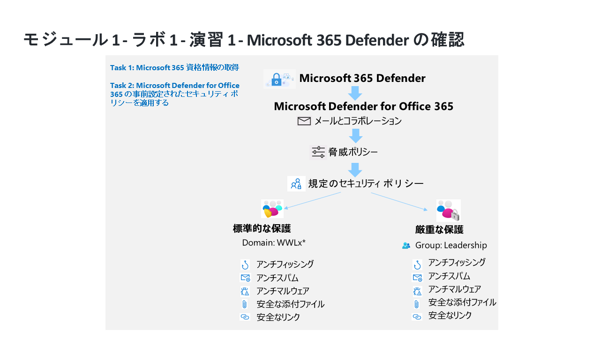

---
lab:
    title: '01 - Microsoft 365 Defender の確認'
    module: 'モジュール 01 – Microsoft 365 Defender を使用して脅威を軽減する'
---

# モジュール 1 - ラボ 1 - 演習 1 - Microsoft 365 Defender の確認 

## ラボ シナリオ

あなたは Microsoft 365 Defender を実装している企業で働くセキュリティ オペレーションアナリストです。EOP と Microsoft Defender for Office 365 に事前設定されたセキュリティ ポリシーを割り当てることにより開始しました。

### タスク 1: Microsoft 365 資格情報の取得

ラボを起動すると、無料のトライアル テナントを利用して Microsoft Virtual Lab 環境にアクセスできるようになります。このテナントには自動的に一意のユーザー名とパスワードが割り当てられます。Microsoft Virtual Lab 環境で Azure と Microsoft 365 にサインインするには、このユーザー名とパスワードを取得する必要があります。 

このコースは、学習パートナーが複数の認証済みラボ ホスティング プロバイダーのいずれかを使用して実施することもあり、お使いになっているテナントに関連のあるテナント ID を取得する実際の手順はラボ ホスティング プロバイダーに応じて異なります。このため、コース内での当該情報の取得方法については、講師が必要な指示を行います。後ほど使用できるよう以下の情報に留意してください。

- **テナント サフィックス ID:** この ID は、ラボ全体で Microsoft 365 にサインインする際に使用する onmicrosoft.com アカウント用です。形式は **{username}@ZZZZZZ.onmicrosoft.com** です。ZZZZZZ はラボ ホスティング プロバイダーの提供した一意のテナント サフィックス ID です。後で使用できるよう、この ZZZZZZ を記録しておきます。ラボの手順で Microsoft 365 ポータルにサインインするよう指示されたら、ここで取得した ZZZZZZ の値を入力してください。
    
- **テナント パスワード:** これは、ラボ ホスティング プロバイダーの提供する管理者アカウント向けのパスワードです。

### タスク 2: Microsoft Defender for Office 365 の事前設定されたセキュリティ ポリシーを適用する

このタスクでは、EOP と Microsoft Defender for Office 365 に対して事前設定されたセキュリティ ポリシーを Microsoft 365 セキュリティ ポータルに割り当てます。

1. 管理者として WIN1 仮想マシンにログインします。パスワードは**Pa55w.rd** です。  

2. 新しい Microsoft Edge ブラウザーを起動します。

3. Edge ブラウザーで Microsoft 365 Defender ポータルに進みます (https://security.microsoft.com)。

4. **サインイン** ダイアログ ボックスで、ラボ ホスティング プロバイダーの提供した管理者ユーザー名のテナント電子メール アカウントをコピーして貼り付け、「**次へ**」を選択します。

5. **パスワードの入力**ダイアログ ボックスで、ラボ ホスティング プロバイダーの提供した管理者のテナント パスワードをコピーして貼り付け、**サインイン**します。

> **注**: 「このセクションにアクセスできません」というメッセージが表示されたら、5 分待ってから再びお試しください。  アクセス ルールがテナントを伝播する必要がある場合があり、これには数分かかる場合があります。  

6. Microsoft 365 Defender のクイック ツアーが表示された場合は、閉じてください。

6. ナビゲーション メニューの「**メールとコラボレーション**」で、「**ポリシーとルール**」を選択します。

7. 「**ポリシーとルール**」ダッシュボードで、「**脅威ポリシー**」を選択します。

8. 「**ポリシー**」ダッシュボードで、「**メールとコラボレーション**」 を選択します。

9. 「**標準的な保護**」の下で、「**保護設定を管理する**」を選択します。

10. 「**保護の適用先**」で「**特定の受信者**」を選択し、「**ドメイン**」の下で、テナントのドメイン名を書き込み、それを選択して、「**次へ**」を選択します。この構成は、アンチスパム、送信スパム フィルター、アンチマルウェア、アンチフィッシングにポリシーを適用することに注意してください。

11. 「**Defender for Office 365 保護を適用する**」で「**特定の受信者**」を選択し、前の手順と同じ構成を適用し、「**次へ**」を選択します。この構成は、アンチフィッシング、安全な添付ファイル、安全なリンクにポリシーを適用することに注意してください。レビューまで「**次へ**」をクリックします。

12. 「**変更を確認し確定する**」の下の内容を読み、「**確認**」を選択して変更を適用し、「**完了**」を選択して完了します。

13. 「**厳重な保護**」の下で、「**管理**」を選択します。

14. 「**Exchange Online Protection を適用する**」で「**特定の受信者**」を選択し、「**グループ**」の下で、「**Leadership**」を書き込み、それを選択して、「**次へ**」を選択します。この構成は、アンチスパム、送信スパム フィルター、アンチマルウェア、アンチフィッシングにポリシーを適用することに注意してください。

15. 「**Defender for Office 365 保護を適用する**」で「**特定の受信者**」を選択し、前の手順と同じ構成を適用し、「**次へ**」を選択します。この構成は、アンチフィッシング、安全な添付ファイル、安全なリンクにポリシーを適用することに注意してください。「**ポリシーモード**」まで「**次へ**」をクリックします。

16. 「ポリシーモード」セクションで、「Turn on the policy after I finish」のラジオボタンをチェックし、「**次へ**」をクリックします。

16. 「**変更を確認し確定する**」 の下の内容を読み、「**確認**」を選択して変更を適用し、「**完了**」を選択して完了します。

> エラー画面が出た場合は、「OK」ボタンをクリックし、メインページに戻り「キャンセル」をクリックします。「**厳重な保護はオンです**」が有効になっていることが確認できます。

17. 上部中央のメニューで、「**Threat policies** (脅威に関するポリシー) を選択して戻り、「**ポリシー**」の下で、「**安全な添付ファイル**」を選択します。ここでは、両方の事前設定されたポリシーが表示され、状態がオンであることに注意してください。

18. メニューで、「**グローバル設定**」を選択します。.

19. 利用可能のオプションに目を通して、「**Turn on Defender for Office 365 for SharePoint, OneDrive, and Microsoft Teams**」 (SharePoint、OneDrive、Microsoft Teams に対して Microsoft Defender for Office 365 を有効にする) の下で、トグルを選択し、「**保存**」を選択します。

## これでラボは完了です。

