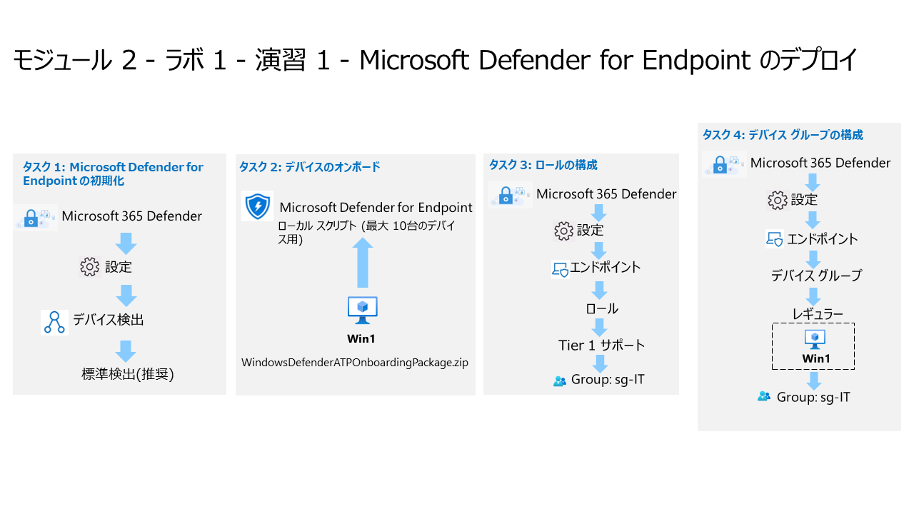

# モジュール 2 - ラボ 1 - 演習 1 - Microsoft Defender for Endpoint のデプロイ

## ラボ シナリオ

あなたは Microsoft Defender for Endpoint を実装している企業で働くセキュリティ オペレーション アナリストです。あなたの上司は、いくつかのデバイスをオンボードして、セキュリティ オペレーション (SecOps) チームの応答手順で必要な変更に関する情報を提供しようとしています。

最初に、Defender for Endpoint 環境を初期化します。次に、デバイスでオンボード スクリプトを実行し、デプロイ対象の初期デバイスをオンボードします。環境のセキュリティを構成します。最後に、デバイス グループを作成し、適切なデバイスを割り当てます。

>**ノート:** **[interactive lab simulation](https://mslabs.cloudguides.com/guides/SC-200%20Lab%20Simulation%20-%20Deploy%20Microsoft%20Defender%20for%20Endpoint)** このラボを自分のペースで確認できます。ホスト型のラボと多少の違いはありますが、主要な概念とアイデアは同じです。

### タスク 1: Microsoft Defender for Endpoint の初期化

このタスクでは、Microsoft Defender for Endpoint ポータルの初期化を行います。

1. 管理者として WIN1 仮想マシンにログインします。パスワードは **Pa55w.rd** です。  

2. Microsoft 365 Defender ポータルにまだアクセスしていない場合は、Microsoft Edge ブラウザーを起動します。

3. Edge ブラウザーで Microsoft Defender ポータルに進みます ( https://security.microsoft.com )。

4. **サインイン** ダイアログ ボックスで、ラボ ホスティング プロバイダーの提供した管理者ユーザー名のテナント電子メール アカウントをコピーして貼り付け、「**次へ**」を選択します。

5. **パスワードの入力**ダイアログ ボックスで、ラボ ホスティング プロバイダーの提供した管理者のテナント パスワードをコピーして貼り付け、**サインイン** します。

6. **Microsoft 365 Defender** ポータルのナビゲーション メニューで、左側から 「**設定**」 を選択します。

7. 「**設定**」 ページで、「**Microsoft 365 Defender**」 を選択します。設定できる内容を確認します。

### タスク 2: デバイスのオンボード

このタスクでは、オンボーディング スクリプトを使用してデバイスを Microsoft Defender for Endpoint にオンボードします。

1. ブラウザーで Microsoft 365 Defender ポータルにまだアクセスしていない場合は、Microsoft Edge ブラウザーを起動して、(https://security.microsoft.com) にアクセスし、**テナントのメールアドレス** の資格情報をログインしてください。

2. 左側のメニュー バーから 「**設定**」 を選択し、「設定」 ページから 「**エンドポイント**」 を選択します。

3. デバイス管理セクションで 「**オンボーディング**」を選択します。

4. 「1.オンボード デバイス」領域で、オペレーティングシステムで「Windows10 と Windows11」を選択し、「展開方法」 ドロップダウンに 「ローカル スクリプト (最大 10台のデバイス用)」 が表示されていることを確認し、「**オンボード パッケージのダウンロード**」 ボタンを選択します。マウスを使って、"WindowsDefenderATPOnboardingPackage.zip" ファイルを強調表示させ、フォルダ－ アイコン「**フォルダーに表示**」を選択します。

5. ダウンロードした zip ファイルを右クリックして、「**すべて展開...**」を選択します。「**完了時に展開されたファイルを表示する**」にチェックが入っていることを確認し、「**展開**」を選択します。

6. 展開されたファイル (WindowsDefenderATPLocalOnboardingScript.cmd) を右クリックし、「**管理者として実行**」を選択します。  Windows SmartScreen が発生した場合は、「**詳細情報**」を選択し、「**実行**」を選択します。

> **注:** 既定では、ファイルは c：\ users \ admin \ downloads ディレクトリにあります。
    
7. "ユーザー アカウント制御" ウィンドウが表示されたら、「**はい**」を選択して、スクリプトの実行を許可します。スクリプトにより提示される質問に「**Y**」を回答し、**Enter** キーを押します。完了したら、コマンド画面に "Successfully onboarded machine to Microsoft Defender for Endpoint (マシンの Microsoft Defender for Endpoint へのオンボードに成功しました)" という内容のメッセージが表示されます。任意のキーを押して、ウィンドウを閉じます。

8. ポータルの「オンボーディング」ページの "2.Run a detection test (検出テストの実行)" 領域で、「**コピー**」ボタンを選択して、検出テスト スクリプトをコピーします。  Windows の検索バーで、「**CMD**」と入力し、右側のペインで、「**管理者として実行**」を選択します。"ユーザー アカウント制御" ウィンドウが表示されたら、「**はい**」を選択して、アプリの実行を許可します。「**管理者: コマンド プロンプト**」ウィンドウで、**Enter** キーを押して、実行します。ウィンドウは、スクリプトの実行後、自動的に閉じます。

9. Microsoft 365 Defender ポータルで、「アセット」セクションの「**デバイス**」 を選択します。お使いになっているデバイスがリストに表示されます。

> **注:** デバイスがポータルに表示されるまでに最高 5 分かかることがあります。デバイスが表示されない場合は、次のタスクを完了して戻り、後で確認してください。

### タスク 3: 役割（Role）の構成

このタスクでは、デバイス グループで使用するロールを設定します。

1. Microsoft 365 Defender ポータルで、左側のメニューバーから 「**設定**」 を選択し、「**エンドポイント**」 を選択します。 

2. アクセス許可エリアで「**役割**」を選択します。

3. 「**ロールを有効にする**」ボタンを選択します。

4. 「**+ 役割を追加**」を選択します。

5. ロールの追加 ダイアログで以下を入力します。

    |全般設定|値|
    |:----|:----|
    |ロール名|Tier 1 サポート|
    |アクセス許可|Live responseの機能 - 上級|

6. 「**割り当てられたユーザー グループ**」 タブを選択します。「**sg-IT**」を選び、「**選択したグループを追加**」を選択します。「このロールを持つ Azure AD ユーザー グループ」の下に表示されることを確認してください。

7. **「保存」** を選択します。

### タスク 4: デバイス グループの構成

このタスクでは、アクセス コントロールと自動化の設定が可能なデバイス グループを構成します。

1. Microsoft 365 Defender ポータルで、左側のメニューバーから 「**設定**」 を選択し、「**エンドポイント**」 を選択します。 

2. アクセス許可エリアで 「**デバイス グループ**」 を選択します。

3. 「**+ デバイスグループの追加**」を選択します。

4. 全般 タブに次の情報を入力します。

    |全般設定|値|
    |:----|:----|
    |デバイス グループ名|レギュラー|
    |修復レベル|完全 - 自動的な脅威の修正|

5. 「**次へ**」を選択します。

6. OS 条件の 「デバイス」 タブで、「**Windows 10**」 を選択し、「**次へ**」 を選択します。

7. 「デバイスのプレビュー」タブで、「**プレビューの表示**」を選択して、WIN1 仮想マシンを表示できます。「**次へ**」を選択します。

8. ユーザー アクセス タブで「**sg-IT**」を選び、「**選択したグループを追加**」ボタンを選択します。「このデバイス グループにアクセスできる Azure AD ユーザー グループ」の下に表示されることを確認してください。

9. 「**送信**」 を選択します。

10. これでデバイス グループの構成が変わりました。「**完了**」 を選択して、「**変更を適用**」をクリックします。

## 演習 2 に進みます。

