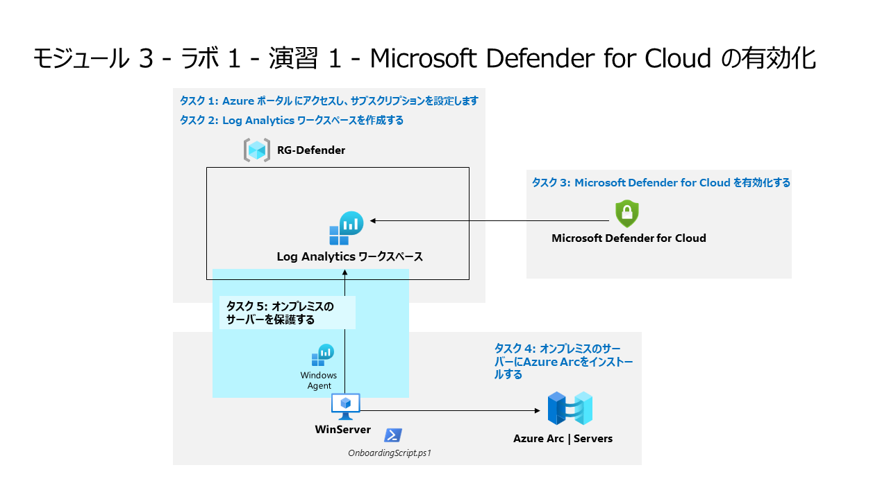

# モジュール 3 - ラボ 1 - 演習 1 - Microsoft Defender for Cloud の有効化

## ラボ シナリオ

あなたは、Microsoft Defender for Cloud を使用してクラウド ワークロード保護を実装している企業に勤務するセキュリティ オペレーションアナリストです。  このラボでは、Microsoft Defender for Cloud を有効化します。

>**ノート:** **[interactive lab simulation](https://mslabs.cloudguides.com/guides/SC-200%20Lab%20Simulation%20-%20Enable%20Microsoft%20Defender%20for%20Cloud)** このラボを自分のペースで確認できます。ホスト型のラボと多少の違いはありますが、主要な概念とアイデアは同じです。

### タスク 1: Azure ポータル にアクセスし、サブスクリプションを設定します。

このタスクでは、このラボと今後のラボを完了するために必要なAzureサブスクリプションを設定します。

1. 管理者として WIN1 仮想マシンにログインします。パスワードは**Pa55w.rd** です。  

2. Microsoft Edge ブラウザーを開くか、すでに開いている場合は、新しいタブを開きます。

3. Microsoft Edgeブラウザーで Azure portal (https://portal.azure.com) に移動します。

4. **サインイン** ダイアログ ボックスで、ラボ ホスティング プロバイダーの提供した管理者ユーザー名のテナント電子メール アカウントをコピーして貼り付け、「**次へ**」を選択します。

5. **パスワードの入力**ダイアログ ボックスで、ラボ ホスティング プロバイダーの提供した管理者のテナント パスワードをコピーして貼り付け、**サインイン**します。

6. Azureポータルの検索バーに「**サブスクリプション**」を入力し「**サブスクリプション**」を選択します。. 

7. **"Azure Pass - スポンサープラン"** のサブスクリプションをクリックします。。
8. 「**アクセス制御 (IAM)**」を選択し、メニューから「＋追加」、「ロールの割り当ての追加」をクリックします。
9. 「**特権管理者ロール**」タブを選択し、「所有者」を選択して、「次へ」をクリックします。
10. 「メンバー」タブで、「＋メンバーを追加する」をクリックし、「**MOD Administrator**」を選択して、「選択」ボタンをクリックします。「次へ」をクリックします。
11. 「条件」タブで、「ユーザーができること」で、「ユーザーにすべてのロールの割り当てを許可する (高い特権) 」にチェックを入れて、「次へ」をクリックします。
12. 「レビューと割り当て」をクリックして、所有者ロールを管理者アカウントに割り当てます。

  > **重要:** これらのラボは、クラス中に 10 米ドル未満の Azure サービスを使用するように設計されています。

<!--
### タスク 2: Log Analytics ワークスペースを作成する。

このタスクでは、Microsoft Defender for Cloud で使用する Log Analytics ワークスペースを作成します。

1. Azureポータルの検索バーに「**Log Analytics**」を入力し 「**Log Analytics ワークスペース**」を選択します。

2. コマンド バーから 「**+ 作成**」を選択します。

3. リソース グループの「**新規作成**」 を選択します

4. 「**RG-Defender**」と入力し、「**OK**」を選択します。

5. 名前は他のユーザーと同じにならないよう **一意** の名前を入力します。地域は **「East US」** を選択します。

6. 「**確認および作成**」をクリックします。

7. ワークスペースの検証に合格したら、「**作成**」をクリックします。新しいワークスペースがプロビジョニングされるのを待ちます。これには数分かかる場合があります。
--!>

### タスク 3: Microsoft Defender for Cloud を有効化する。

このタスクでは、Microsoft Defender for Cloud を有効化および構成します。

1. Azure portal の検索バーに「**Defender**」と入力し、「**Microsoft Defender for Cloud**」を選択します。

2. 「**はじめに**」ページで、「**アップグレード**」ボタンを選択します。

3. **「Microsoft Defender for Cloud | 概要」** ページが表示されます。

4. ポータルメニューの管理領域から「**環境設定**」を選択します。

5. **「Azure Pass - スポンサープラン」** サブスクリプションを選択します。 

6. **Defenderプラン** の状態を確認し、すべてのDefender プランがオフの場合は、「**すべて有効にする**」をクリックして **「保存」** をクリックします。

7. ページの右上にある 「X」 を選択して設定ページを閉じて 「環境設定」 に戻り、サブスクリプションの左側にある 「>」 を選択します。

8. 前に作成したログ分析ワークスペースを選択して、使用可能なオプションと価格を確認します。

9. **すべて有効にする** をクリックし、**「保存」** をクリックします。

10. ページの右上にある 「X」 を選択して設定ページを閉じて 「環境設定」 に戻ります。

### タスク 4: オンプレミスのサーバーにAzure Arcをインストールする。

このタスクではオンプレミスサーバーに Azure Arcをインストールして、オンボードを容易にします。

1. 管理者として **WINServer** 仮想マシンにログインします。パスワードは**Passw0rd!**  

2. Microsoft Edge ブラウザーを開き、Azure portal (https://portal.azure.com) に移動します。

3. **サインイン** ダイアログ ボックスで、ラボ ホスティング プロバイダーから提供された**テナントの電子メール**アカウントをコピーして貼り付け、「**次へ**」を選択します。

4. **パスワードの入力**ダイアログ ボックスで、ラボ ホスティング プロバイダーから提供された**テナントパスワード** をコピーして貼り付け、「**サインイン**」を選択します。

5. Azureポータルの検索バーに「*Arc*」と入力し「**AzureArc**」を選択します。

6. 「ナビゲーション」ペインの「**インフラストラクチャ**」の下で、「**Machines**」を選択します。

7. 「**+ Add/Create**」から「**Add a machine**」を選択します。

8. 単一サーバーの追加セクションで「**スクリプトの生成**」を選択します。

9. 「**次へ**」を選択して、「リソースの詳細」タブに移動します。

10. 先ほど作成したリソース グループと地域を選択します。ヒント: **RG-Defender** および **East US**

  > **注:** リソースグループをまだ作成していない場合。別のタブを開き、リソースグループを作成します。

11. 「**サーバーの詳細**」と「**ネットワーク接続**」オプションを確認します。「**次へ**」を選択して、「タグ」タブに移動します。

12. 「**次へ**」を選択して、「**Azure Arcを使用してサーバーを追加**」に移動します。

13. 「**Azure Arcを使用してサーバーを追加**」のスクリプトを確認します。。

<!-- > **注:** 処理が終わるまで、3 分間待機します。-->

14. 「**スクリプト**」のコピーをクリックします。 

15. Windows の「スタート」ボタンを右クリックし、「**Windows PowerShell (管理者)**」を選択します。

16. コピーしたスクリプトを入力し、実行します。

<!--
16. プロンプトが表示されたら、ユーザー名に「Administrator」を入力します。

17. プロンプトが表示されたら、パスワードとして「Passw0rd」と入力します。

18. 「cd C:\Users\Administrator\Downloads」と入力します。

19. **Set-ExecutionPolicy -ExecutionPolicy Unrestricted** を入力しEnterキーを押します。

20. 「すべてにはい」の場合は **A** を入力し、Enterキーを押します。

21. コピーしたスクリプトを入力し、実行します。

21. PowerShell の出力の最後の行の指示に従って、デバイスの登録を完了します。 これには、ブラウザーを介したデバイスの認証が含まれます。  URL (https://microsoft.com/devicelogin) をコピーして、新しい Microsoft Edge ブラウザーのタブに入力します。「Windows PowerShell」ウィンドウに戻り、認証のためのコードをコピーして、以前に開いたタブに貼り付け、「**次へ**」を選択します。テナントの管理者アカウントを選択して、「**Are you trying to sign in to Azure Connected Machine Agent?**」 (Azure Connected Machine Agent へのサインインを試みていますか?) ウィンドウで、「**続行**」を選択します。 

23. 「Windows PowerShell」ウィンドウで、**"Successfully Onboarded Resource to Azure"** (リソースが Azure に正常にオンボードされました) というメッセージが表示されたら、Azure portal ページに戻り、**スクリプトのダウンロードと実行** タブで「**閉じる**」をクリックします。「**Add servers with Azure Arc**」 (Azure Arc にサーバーを追加する) を閉じて、Azure Arc の「**サーバー**」ページに戻ります。
-->

17. スクリプトの進行中に、Auzre アカウントが要求たら既存のアカウントを選択します。ブラウザの別ウィンドウが起動し、「Authentication cmplete」が表示されます。

18. 「**Azure Arcを使用してサーバーを追加**」を閉じます。

19. 「**サーバー**」に **WINServer** サーバー名が表示されるまで「**更新**」を選択します。

  > **注:** この処理には数分かかります。

### タスク 5: オンプレミスのサーバーを保護する。

このタスクでは、WINServer 仮想マシンにデータ収集ルール (DCR) を追加して、Azure Monitor エージェントを手動でインストールします。

このタスクでは、必要なエージェントをWindowsServerに手動でインストールします。

1. "Microsoft Defender for Cloud" に移動します。

2. 「**インベントリ**」 を選択します。

3. メニューから「**非 Azure サーバーの追加**」をクリックします。

4. 前に作成したワークスペースの横にある「**アップグレード**」を選択します。これには数分かかる場合があります。**"Defender plans for workspace were saved successfully"** (ワークスペース用 Defender プランが正常に保存されました) という通知が表示されるまで待機します。

5. 前に作成したワークスペースの横にある「**＋サーバーの追加**」を選択します。

6. 「**データ収集ルール**」を選択します。

7. 「＋作成」を選択します。

8. 基本タブで下記の情報を入力し、「次へ：リソース」を選択します。

    |設定|値|
    |---|---|
    |ルール名|WINServer|
    |サブスクリプション|Azure Pass - スポンサープラン|
    |リソースグループ|RG-Defender|
    |Reagion|East US|
    |プラットフォームの種類|Windows|

9. 「＋リソースの追加」を選択し、RG-Defenderのリソースグループを展開して、「**WINServer**」を選択して「適用」を選択します。

10. 「次へ：収集と配信」を選択します。

11. 「**収集と配信**」タブで「**＋データソースの追加**」を選択します。

13. 「データソースの種類」で「パフォーマンスカウンター」を選択します。

14. 「次へ：ターゲット」を選択し、「＋ターゲットの追加」を選択します。

    |ターゲットの種類|アカウントまたは名前空間|
    |---|---|
    |Azure Monitor Logs|**作成したLogAnalyticsワークスペースを選択**|

15. 「確認と作成」を選択します。
16. 検証に成功した後に、「作成」を選択します。
17. **データ収集ルール** を作成すると WINServer への AzureMonitorWindowsAgent 拡張機能のインストールが開始されます。
18. データ収集ルールの作成が完了したら、Azure ARCの「WINServer」を確認します。
19. 「設定」セクションの「拡張機能」を選択します。
20. **AzureMonitorWindowsAgent** が「成功」の状態で一覧表示されます。
21. 次のラボに進み、しばらくたってから Microsoft Defender for Cloud の [インベントリ] セクションを確認し、WINServer が含まれていることを確認できます。

# 演習 2 に進みます。
