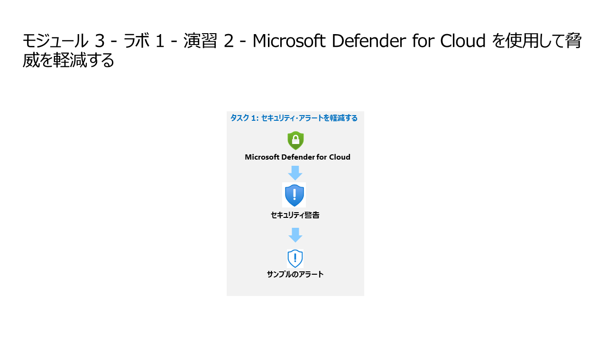

# モジュール 3 - ラボ 1 - 演習 2 - Microsoft Defender for Cloud を使用して脅威を軽減する

## ラボ シナリオ

あなたは Microsoft Defender for Cloud. を実装している企業で働くセキュリティ オペレーション アナリストです。Microsoft Defender for Cloud. によって生成されたセキュリティ アラートに応答する必要があります。

>**Note:** An **[interactive lab simulation](https://mslabs.cloudguides.com/guides/SC-200%20Lab%20Simulation%20-%20Mitigate%20threats%20using%20Microsoft%20Defender%20for%20Cloud)** このラボを自分のペースで確認できます。ホスト型のラボと多少の違いはありますが、主要な概念とアイデアは同じです。 

### タスク 1: 規制コンプライアンスの調査

このタスクでは、Microsoft Defender for Cloud での規制コンプライアンスの構成を確認します。

1. 管理者として WIN1 仮想マシンにログインします。パスワードは Pa55w.rd です。 

1. Microsoft 365 Defender ポータルにまだアクセスしていない場合は、Microsoft Edge ブラウザーを起動します。Edge ブラウザーで Microsoft Defender ポータルに進みます ( https://security.microsoft.com )。

1. **サインイン** ダイアログ ボックスで、ラボ ホスティング プロバイダーの提供した管理者ユーザー名のテナント電子メール アカウントをコピーして貼り付け、「次へ」を選択します。

1. **パスワード** の入力ダイアログ ボックスで、ラボ ホスティング プロバイダーの提供した管理者のテナント パスワードをコピーして貼り付け、サインイン します。

1. Azure portal の検索バーに「*Defender*」と入力し、「**Microsoft Defender for Cloud**」を選択します。

1. *クラウドセキュリティ*セクションにある、**規制コンプライアンス** をクリックします。

1. ツールバーの **コンプライアンスポリシーの管理** をクリックします。

1. サブスクリプションをクリックします。

1. ポリシー設定セクションの **セキュリティポリシー** をクリックします。

1. デフォルトで利用可能な「業界と規制の基準」を確認します。ISO 27001 は現在非推奨であることに注意してください。

1. **標準をさらに追加** をクリックし、ISO 27001:2013 を追加します。

1. ポリシーイニシアティブのページが表示されます。スコープの設定がサブスクリプションになっていることを確認して、「確認および作成」をクリックします。

1. 「作成」をクリックします。

1. Microsoft Defender for Cloud のメインブレードに移動します。

### タスク 2: セキュリティ態勢と推奨事項を調べる

このタスクでは、クラウドのセキュリティ態勢管理を確認します。セキュリティ スコア情報の再計算には 24 時間かかる場合があります。このタスクは24時間以内に再度実行することをお勧めします。

1. *クラウドセキュリティ*セクションにある、**セキュリティ態勢** をクリックします。

1. セキュリティ スコアは、スコアが計算されるまで 「該当なし」 と表示される可能性が最も高いです。

1. *全般*セクションにある、**推奨事項** をクリックします。

1. サブスクリプションと WINServer (アーク サーバー) に対して提供されている推奨事項を確認します。

1. WINServer の状態が "完了" でない推奨事項を選択します。

1. 委任セクションで、「**所有者の割り当てと期限の設定**」を選択します。

1. **割り当ての詳細** をクリックして **所有者の設定** で「MOD Administrator」を選択します。

1. 「修復機関」 を好みに合わせて変更して、「作成」をクリックします。

    >**ノート:**「要求された割り当ての作成に失敗しました」というエラーが表示された場合は、後でもう一度やり直してください。

1. ウィンドウの右上にある 「X」を選択して、推奨事項ページを閉じます。

### タスク : セキュリティ・アラートを軽減する

このタスクでは、サンプルのセキュリティアラートを読み込み、アラートの詳細を確認します。

1. ポータル メニューの「**全般**」の下で、「**セキュリティ警告**」を選択します。

1. コマンド バーから 「**サンプルのアラート**」 を選択します (ヒント: コマンド バーから省略記号ボタンを選択する必要がある場合があります)。

1. サンプルアラートの作成（プレビュー）ペインで、サブスクリプションが選択されていることを確認します。  **Defender for Cloud プラン** 領域ですべてのサンプル アラートが選択されていることを確認し、「**サンプルアラートの作成**」を選択します。  

    >**注**: このサンプル アラートの作成プロセルは、完了まで数分かかる場合があります。"Successfully created sample alerts"(サンプル アラートが正常に作成されました) という通知が表示されるまで待機します。完了すると、各アラートが**セキュリティ アラート**領域に表示されます。

1. 各アラートについて、次のアクションを実行します。

    A. アラートを選択すると、アラートに関する情報が表示されます。「**すべての詳細を表示**」を選択します。

    B. 「**アラートの詳細**」タブを確認し、全体を読みます。

    C. 「**アクションの実行**」タブを選択します。

    D. 「**アクションの実行**」情報を確認します。アラートのタイプに応じてアクションを実行できるボタンに注意してください。

## これでラボは完了です。
