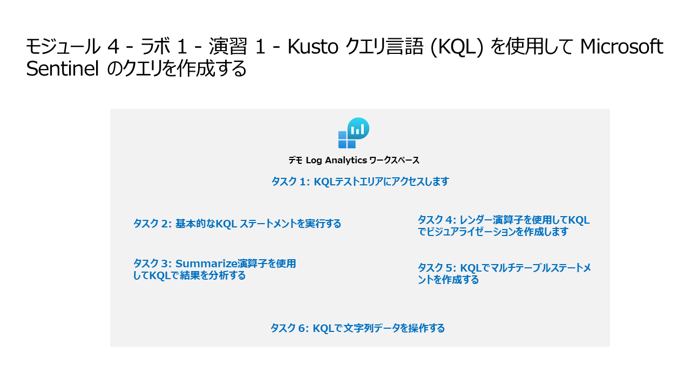

# モジュール 4 - ラボ 1 - 演習 1 - Kusto クエリ言語 (KQL) を使用して Microsoft Sentinel のクエリを作成する

## ラボ シナリオ



あなたは、Microsoft Sentinel を実装しようとしている会社で働いているセキュリティ オペレーションアナリストです。悪意のあるアクティビティを検索し、視覚化を表示し、脅威ハンティングを実行するためにログ データ分析を行う責任があります。ログ データのクエリを実行するには、Kusto クエリ言語 (KQL) を使用します。

> **ヒント:** このラボでは、多くの KQL スクリプトを Azure Sentinel に入力します。スクリプトは、このラボの始めのファイルに含まれています。次の URL からもダウンロードできます。  https://github.com/MicrosoftLearning/SC-200T00A-Microsoft-Security-Operations-Analyst/tree/master/Allfiles


### タスク 1: KQLテストエリアにアクセスします。

このタスクでは、KQLステートメントの記述を練習できるLog Analytics環境にアクセスします。

1. 管理者として WIN1 仮想マシンにログインします。パスワードは**Pa55w.rd** です。  

2. ブラウザーで https://aka.ms/lademo にアクセスします。MOD管理者の資格情報を使用してログインします。 

3. 画面左側のタブのリストから使用可能なテーブルを調べます。

4. クエリエディタで、次のクエリを入力し、「**実行**」ボタンを選択します。  下部のウィンドウにクエリ結果が表示されます。

```KQL
SecurityEvent
```

5. 最初のレコードの横にある「**>**」を選択して、行の情報を展開します。

### タスク 2: 基本的なKQL ステートメントを実行する

このタスクでは 基本的なKQL ステートメントを作成します。

> **重要:**  各手順で、クエリ ウィンドウから前のステートメントをクリアするか、最後に開いたタブ (最大 25) の後の「**+**」を選択して新しいクエリ ウィンドウを開きます。

1. 次の文は、テーブル内のすべてのカラムで値を検索する検索演算子を示しています。クエリ ウィンドウで次のステートメントを入力し、「**実行**」を選択します。

```KQL
search "err"
```

1. 次の文は、**in** 内にリストされたテーブル間の検索を示しています。クエリ ウィンドウで次のステートメントを入力し、「**実行**」を選択します。

```KQL
search in (SecurityEvent,SecurityAlert,A*) "err"
```
1. クエリ ウィンドウで 「**時間の範囲**」 を 「**過去 24 時間**」 に戻します。

1. 次の文は、特定の述語をフィルタリングする **where** 演算子を示しています。クエリ ウィンドウで次のステートメントを入力し、「**実行**」を選択します。

```KQL
SecurityEvent  
| where TimeGenerated > ago(1h)
```

```KQL
SecurityEvent  
| where TimeGenerated > ago(1h) and EventID == "4624"
```

```KQL
SecurityEvent  
| where TimeGenerated > ago(1h)
| where EventID == 4624
| where AccountType =~ "user"
```

```KQL
SecurityEvent  
| where TimeGenerated > ago(1h) and EventID in (4624, 4625)
```

1. 次の文は、**let** 文を使用して変数を宣言する方法を示しています。クエリ ウィンドウで次のステートメントを入力し、「**実行**」を選択します。

```KQL
let timeOffset = 1h;
let discardEventId = 4688;
SecurityEvent
| where TimeGenerated > ago(timeOffset*2) and TimeGenerated < ago(timeOffset)
| where EventID != discardEventId
```

1. 次の文は、**let** 文を使用して動的リストを宣言する方法を示しています。クエリ ウィンドウで次のステートメントを入力し、「**実行**」を選択します。

```KQL
let suspiciousAccounts = datatable(account: string) [
  @"\administrator", 
  @"NT AUTHORITY\SYSTEM"
];
SecurityEvent  
| where TimeGenerated > ago(1h)
| where Account in (suspiciousAccounts)
```
 > ヒント：クエリの書式を簡単に再設定するには、「**クエリ**」 ウィンドウのメニューから「**クエリの形式設定**」を選択します。

1. 次の文は、**let** 文を使用して動的テーブルを宣言する方法を示しています。クエリ ウィンドウで次のステートメントを入力し、「**実行**」を選択します。

```KQL
let LowActivityAccounts =
    SecurityEvent 
    | summarize cnt = count() by Account 
    | where cnt < 1000;
LowActivityAccounts | where Account contains "sql"
```

1. クエリ ウィンドウで 「**時間の範囲**」 を 「**過去 30分**」に変更します。これにより、次のステートメントの結果が制限されます。

1. 次の文は、計算カラムを作成して結果セットに追加する **extend** 演算子を示しています。クエリ ウィンドウで次のステートメントを入力し、「**実行**」を選択します。

```KQL
SecurityEvent  
| where TimeGenerated > ago(1h)
| where ProcessName != "" and Process != ""
| extend StartDir =  substring(ProcessName,0, string_size(ProcessName)-string_size(Process))
```

1. 次の文は、入力テーブルのローを 1 つ以上のカラムで昇順または降順でソートする **order by** 演算子を示しています。**order by** 演算子は、並べ替え演算子のエイリアスです。クエリ ウィンドウで次のステートメントを入力し、「**実行**」を選択します。

```KQL
SecurityEvent  
| where TimeGenerated > ago(1h)
| where ProcessName != "" and Process != ""
| extend StartDir =  substring(ProcessName,0, string_size(ProcessName)-string_size(Process))
| order by StartDir desc, Process asc
```

1. 次のステートメントは、指定した順序で含める列を選択する **project** 演算子を示しています。クエリ ウィンドウで次のステートメントを入力し、「**実行**」を選択します。

```KQL
SecurityEvent  
| where TimeGenerated > ago(1h)
| where ProcessName != "" and Process != ""
| extend StartDir =  substring(ProcessName,0, string_size(ProcessName)-string_size(Process))
| order by StartDir desc, Process asc
| project Process, StartDir
```

1. 次のステートメントは、出力から除外する列を選択する project-away 演算子を示しています。クエリ ウィンドウで次のステートメントを入力し、「**実行**」を選択します。

```KQL
SecurityEvent  
| where TimeGenerated > ago(1h)
| where ProcessName != "" and Process != ""
| extend StartDir =  substring(ProcessName,0, string_size(ProcessName)-string_size(Process))
| order by StartDir desc, Process asc
| project-away ProcessName
```

### タスク 3: Summarize 演算子を使用してKQLで結果を分析する

このタスクでは、データを集計する KQL ステートメントを作成します。集計では、グループ別の列に従って行がグループ化され、各グループの集計が計算されます。

1. 次の文は、グループの数を返す **count()** 関数を示しています。クエリ ウィンドウで次のステートメントを入力し、「**実行**」を選択します。

```KQL
SecurityEvent  
| where TimeGenerated > ago(1h) and EventID == '4688'  
| summarize count() by Process, Computer
```

1. 次のステートメントは **count()** 関数を示していますが、この例では、カラムに *cnt* という名前を付けています。クエリ ウィンドウで次のステートメントを入力し、「**実行**」を選択します。

```KQL
SecurityEvent  
| where TimeGenerated > ago(1h) and EventID == '4624'  
| summarize cnt=count() by AccountType, Computer
```

1. 次の文は、グループ要素のおおよその個別カウントを返す **dcount()** 関数を示しています。クエリ ウィンドウで次のステートメントを入力し、「**実行**」を選択します。

```KQL
SecurityEvent  
| where TimeGenerated > ago(1h)
| summarize dcount(IpAddress)
```

1. 次のステートメントは、同じアカウントの複数のアプリケーション間で無効なパスワードの失敗を検出するルールです。クエリ ウィンドウで次のステートメントを入力し、「**実行**」を選択します。

```KQL
let timeframe = 30d;
let threshold = 1;
SigninLogs
| where TimeGenerated >= ago(timeframe)
| where ResultDescription has "Invalid password"
| summarize applicationCount = dcount(AppDisplayName) by UserPrincipalName, IPAddress
| where applicationCount >= threshold
```

1. 次の文は、引数が最大化されたときに 10 以上の式を返す **arg_max()** 関数を示しています。次の文は、コンピュータ SQL<>.NA.contosohotels.com のセキュリティイベント テーブルから最新の行を返します。**arg_max 関数**の * は、行のすべての列を要求します。クエリ ウィンドウで次のステートメントを入力し、「**実行**」を選択します。

```KQL
SecurityEvent  
| where Computer == "SQL10.na.contosohotels.com"
| summarize arg_max(TimeGenerated,*) by Computer
```

1. 次の文は、引数が最小化されたときに 10 以上の式を返す **arg_min()** 関数を示しています。このステートメントでは、コンピューター SQL<>.NA.contosohotels.com の最も古い SecurityEvent が結果セットとして返されます。クエリ ウィンドウで次のステートメントを入力し、 「**実行**」を選択します。

```KQL
SecurityEvent  
| where Computer == "SQL10.na.contosohotels.com"
| summarize arg_min(TimeGenerated,*) by Computer
```

1. 次のステートメントは、パイプの順序に基づいて結果を理解することの重要性を示しています。「クエリ」 ウィンドウで次のクエリを入力し、各クエリを個別に実行します。

    1. **クエリ 1** には、最後のアクティビティがログインであったアカウントが含まれます。SecurityEvent テーブルが最初に集計され、各アカウントの最新の行が返されます。その後、イベント ID が 4624 (ログイン) に等しい行のみが返されます。

        ```KQL
        SecurityEvent  
        | summarize arg_max(TimeGenerated, *) by Account
        | where EventID == '4624'  
        ```

    1. **クエリ 2** には、ログインしたアカウントの最新のログインが含まれます。セキュリティ イベント テーブルは、イベント ID = 4624 のみを含むようにフィルター処理されます。次に、これらの結果は、アカウントごとに最新のログイン行に集約されます。

        ```KQL
        SecurityEvent  
        | where EventID == '4624'  
        | summarize arg_max(TimeGenerated, *) by Account
        ```

    >**ノート:**  また、右下の 「クエリの詳細」 リンクを選択して 「合計 CPU」 と 「処理されたクエリに使用されたデータ」 を確認し、両方のステートメント間でデータを比較することもできます。

2. 次の文は、グループ内のすべての値のリストを返す **make_list()** 関数を示しています。この KQL クエリは、最初に where 演算子を使用してイベント ID をフィルター処理します。各コンピューターの結果はアカウントの JSON 配列です。結果の JSON 配列には、重複するアカウントが含まれます。クエリ ウィンドウで次のステートメントを入力し、「**実行**」を選択します。

    ```KQL
    SecurityEvent  
    | where TimeGenerated > ago(1h)
    | where EventID == '4624'  
    | summarize make_list(Account) by Computer
    ```

3. 次の文は、グループ内の個別の値のセットを返す **make_set()** 関数を示しています。この KQL クエリは、最初に **where** 演算子を使用してイベント ID をフィルター処理します。各コンピューターの結果は、一意のアカウントの JSON 配列です。クエリ ウィンドウで次のステートメントを入力し、「**実行**」を選択します。

    ```KQL
    SecurityEvent  
    | where TimeGenerated > ago(1h)
    | where EventID == '4624'  
    | summarize make_set(Account) by Computer
    ```

### タスク 4: レンダー演算子を使用してKQLで視覚化を作成します

このタスクでは、KQL ステートメントで視覚化を生成するを使用します。

1. 次のステートメントは、棒グラフの視覚化を使用して、**render** 演算子 (結果をグラフィカル出力としてレンダリングする) を示しています。クエリ ウィンドウで次のステートメントを入力し、「**実行**」を選択します。

    ```KQL
    SecurityEvent  
    | where TimeGenerated > ago(1h)
    | summarize count() by Account
    | render barchart
    ```

1. 次の文は、時系列で結果を視覚化する **render** 演算子を示しています。**bin()** 関数は、時間枠内のすべての値を丸めてグループ化し、**summarize** と組み合わせて頻繁に使用されます。値のセットが散在している場合、値は特定の値のより小さなセットにグループ化されます。生成された結果を結合し、タイムチャートを使用してレンダリング演算子にパイプすると、時系列の視覚化が提供されます。クエリ ウィンドウで次のステートメントを入力し、「**実行**」を選択します。

    ```KQL
    SecurityEvent  
    | where TimeGenerated > ago(1h)
    | summarize count() by bin(TimeGenerated, 1m)
    | render timechart
    ```

### タスク 5: KQLで複数テーブルステートメントを作成する

このタスクでは、複数テーブルの KQL ステートメントを作成します。

1. クエリ ウィンドウで 「時間の範囲」 を 「過去30分」 に変更します。これにより、次のステートメントの結果が制限されます。

1. 次の文は、2 つ以上のテーブルを受け取り、すべてのローを返す **union** 演算子を示しています。パイプ文字で結果がどのように渡され、影響を受けるかを理解することが不可欠です。「クエリ」 ウィンドウで次のステートメントを入力し、クエリごとに個別に「**実行**」を選択して結果を表示します。

    1. **クエリ 1** は、SecurityEvent のすべての行と SigninLogs のすべての行を返します。

        ```KQL
        SecurityEvent  
        | union SigninLogs  
        ```

    1. **クエリ 2** は、SigninLogs のすべての行と SecurityEvent のすべての行を 1 つの行と列で返します。

        ```KQL
        SecurityEvent  
        | union SigninLogs  
        | summarize count() 
        ```

    1. **クエリ 3** は、SecurityEvent のすべての行と SigninLogs の 1 行 (最後の行）を返します。SigninLogs の最後の行には、行の合計数の集計カウントが含まれます。

        ```KQL
        SecurityEvent  
        | union (SigninLogs | summarize count() | project count_)
        ```

1. 次の文は、ワイルドカードを使用して複数のテーブルを受け取り、全てのデーブルの行を返すための **union** 演算子のサポートを示しています。クエリ ウィンドウで次のステートメントを入力し、「**実行**」を選択します。

    ```KQL
    union Security*  
    | summarize count() by Type
    ```

1. 次の文は、2 つのテーブルの行をマージし、各テーブルの指定されたカラムの値を照合して新しいテーブルを形成する **join** 演算子を示しています。クエリ ウィンドウで次のステートメントを入力し、「**実行**」を選択します。

    ```KQL
    SecurityEvent  
    | where EventID == "4624" 
    | summarize LogOnCount=count() by EventID, Account
    | project LogOnCount, Account
    | join kind = inner( 
     SecurityEvent  
    | where EventID == "4634" 
    | summarize LogOffCount=count() by EventID, Account
    | project LogOffCount, Account
    ) on Account
    ```

    >**重要:** join で指定された最初のテーブルは、左側のテーブルと見なされます。join 演算子の後のテーブルが右側のテーブルです。テーブルの列を操作する場合、$left.Column 名と $right.Column 名は、どのテーブル列が参照されているかを区別するためのものです。join 演算子は、flouter、 inner、 innerunique、 leftanti、 leftantisemi、 leftouter、 leftsemi、 rightanti、 rightantisemi、 rightouter、 rightsemi など、さまざまなタイプをサポートしています。

1. クエリ ウィンドウで「時間の範囲」を「過去 24 時間」に戻します。


### Task 6: KQL で文字列データを操作する

このタスクでは、KQL ステートメントを使用して構造化文字列フィールドと非構造化文字列フィールドを操作します。

1. 次の文は、ソース文字列から正規表現の一致を取得する **extract** 関数を示しています。抽出された部分文字列を指定された型に変換するオプションがあります。クエリ ウィンドウで、次のステートメントを入力し、「**実行**」を選択します。

    ```KQL
    print extract("x=([0-9.]+)", 1, "hello x=45.6|wo") == "45.6"
    ```

1. 次の文は、extract 関数を使用して、SecurityEvent テーブルの **Account** フィールドからアカウント名を取得します。クエリ ウィンドウで次のステートメントを入力し、「**実行**」を選択します。

    ```KQL
    SecurityEvent  
    | where EventID == '4672' and AccountType == 'User' 
    | extend Account_Name = extract(@"^(.*\\)?([^@]*)(@.*)?$", 2, tolower(Account))
    | summarize LoginCount = count() by Account_Name
    | where Account_Name != ""
    | where LoginCount < 10
    ```

1. 次の文は、文字列式を評価し、その値を 1 つ以上の計算カラムに解析する **parse** 演算子を示しています。非構造化データの構造化に使用します。クエリ ウィンドウで次のステートメントを入力し、「**実行**」を選択します。

    ```KQL
    let Traces = datatable(EventText:string)
    [
    "Event: NotifySliceRelease (resourceName=PipelineScheduler, totalSlices=27, sliceNumber=23, lockTime=02/17/2016 08:40:01, releaseTime=02/17/2016 08:40:01, previousLockTime=02/17/2016 08:39:01)",
    "Event: NotifySliceRelease (resourceName=PipelineScheduler, totalSlices=27, sliceNumber=15, lockTime=02/17/2016 08:40:00, releaseTime=02/17/2016 08:40:00, previousLockTime=02/17/2016 08:39:00)",
    "Event: NotifySliceRelease (resourceName=PipelineScheduler, totalSlices=27, sliceNumber=20, lockTime=02/17/2016 08:40:01, releaseTime=02/17/2016 08:40:01, previousLockTime=02/17/2016 08:39:01)",
    "Event: NotifySliceRelease (resourceName=PipelineScheduler, totalSlices=27, sliceNumber=22, lockTime=02/17/2016 08:41:01, releaseTime=02/17/2016 08:41:00, previousLockTime=02/17/2016 08:40:01)",
    "Event: NotifySliceRelease (resourceName=PipelineScheduler, totalSlices=27, sliceNumber=16, lockTime=02/17/2016 08:41:00, releaseTime=02/17/2016 08:41:00, previousLockTime=02/17/2016 08:40:00)"
    ];
    Traces  
    | parse EventText with * "resourceName=" resourceName ", totalSlices=" totalSlices:long * "sliceNumber=" sliceNumber:long * "lockTime=" lockTime ", releaseTime=" releaseTime:date "," * "previousLockTime=" previousLockTime:date ")" *  
    | project resourceName, totalSlices, sliceNumber, lockTime, releaseTime, previousLockTime
    ```

1. 次の文は、他のデータ型の任意の値を取ることができる特別な**動的**フィールドの使用を示しています。この例では、SigninLogs テーブルの **DeviceDetail** フィールドの種類は**動的**です。クエリ ウィンドウで次のステートメントを入力し、「**実行**」を選択します。

    ```KQL
    SigninLogs | extend OS = DeviceDetail.operatingSystem
    ```

1. 次の例は、SigninLogs のパッケージされたフィールドを分割する方法を示しています。クエリ ウィンドウで次のステートメントを入力し、「**実行**」を選択します。

    ```KQL
    SigninLogs | extend OS = DeviceDetail.operatingSystem, Browser = DeviceDetail.browser
    | extend CAPol0Name = tostring(ConditionalAccessPolicies[0].displayName), CAPol0Result = tostring(ConditionalAccessPolicies[0].result)
    | extend CAPol1Name = tostring(ConditionalAccessPolicies[1].displayName), CAPol1Result = tostring(ConditionalAccessPolicies[1].result)
    | extend CAPol2Name = tostring(ConditionalAccessPolicies[2].displayName), CAPol2Result = tostring(ConditionalAccessPolicies[2].result)
    | extend StatusCode = tostring(Status.errorCode), StatusDetails = tostring(Status.additionalDetails)
    | extend Date = startofday(TimeGenerated), City = tostring(LocationDetails.city)
    | summarize count() by Date, Identity, UserDisplayName, UserPrincipalName, IPAddress, City, ResultType, ResultDescription, StatusCode, StatusDetails, CAPol0Name, CAPol0Result, CAPol1Name, CAPol1Result, CAPol2Name, CAPol2Result
    | sort by Date
    ```

    >**重要:** 動的なフィールドの種類は JSON のように見えますが、JSON に存在しないため、JSON モデルが表現できない値を保持できます。したがって、動的な値を JSON 形式にする場合、JSON で表現できない値は文字列の値になります。 

1. 次のステートメントは、文字列フィールドに格納されている JSON を操作する演算子を示しています。多くのログは JSON 形式でデータを送信するため、JSON データをクエリ可能なフィールドに変換する方法を知っている必要があります。クエリ ウィンドウで次のステートメントを入力し、 「**実行**」を選択します。

    ```KQL
    SigninLogs | extend Location =  todynamic(LocationDetails)
    | extend City =  Location.city
    | extend City2 = Location["city"]
    | project Location, City, City2
    ```

1. 次の文は、動的配列を行に変換する **mv-expand** 演算子を示しています (複数値展開)。

    ```KQL
    SigninLogs | mv-expand Location = todynamic(LocationDetails)
    ```

1. 次の文は、各レコードにサブクエリを適用し、すべてのサブクエリの結果の和集合を返す **mv-apply** 演算子を示しています。

    ```KQL
    SigninLogs  
    | mv-apply Location = todynamic(LocationDetails) on 
    ( where Location.countryOrRegion == "ES")
    ```

2. 関数は、保存された名前をコマンドとして他のログクエリで使用できるログクエリです。関数を作成するには、クエリを実行した後、「保存」ボタンを選択し、ドロップダウンから「関数として保存」を選択します。「関数名」 ボックスに目的の名前 (例: PrivLogins) を入力し、従来のカテゴリ (例: *General*) を入力して、「保存」を選択します。この関数は、関数のエイリアスを使用して KQL で使用できます。

    >**ノート:** アカウントには閲覧者のアクセス許可しかないため、このラボで使用する lademo 環境ではこれを行うことはできませんが、クエリをより効率的かつ効果的にするための重要な概念です。

    ```KQL
    PrivLogins  
    ```

## これでラボは完了です。
