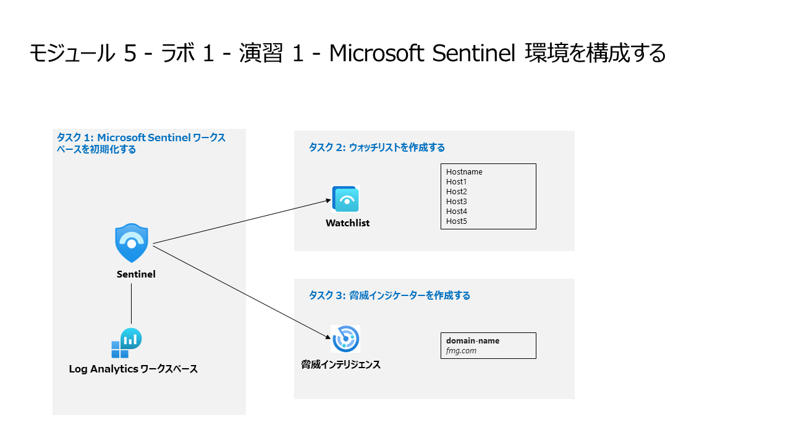

# モジュール 5 - ラボ 1 - 演習 1 - Microsoft Sentinel 環境を構成する

## ラボ シナリオ



あなたは、Microsoft Sentinel を実装しようとしている企業で働いているセキュリティ オペレーションアナリストです。コストを最小限に抑え、コンプライアンス規制を満たし、セキュリティ チームが日常の職務を遂行するのに最も管理しやすい環境を提供するという会社の要件を満たすように、Microsoft Sentinel 環境を設定する責任があります。

### タスク 1: Microsoft Sentinel ワークスペースを初期化する。

このタスクでは、Microsoft Sentinel ワークスペースを作成します。

1. 管理者として WIN1 仮想マシンにログインします。パスワードは**Pa55w.rd** です。  

2. Microsoft Edge ブラウザーを開きます。

3. Microsoft Edge ブラウザーで Azure portal (https://portal.azure.com) に移動します。

4. **サインイン** ダイアログ ボックスで、ラボ ホスティング プロバイダーから提供された**テナントのメール** アカウントをコピーして貼り付け、「**次へ**」を選択します。

5. **パスワードの入力**ダイアログ ボックスで、ラボ ホスティング プロバイダーから提供された**テナントパスワード** をコピーして貼り付け、「**サインイン**」を選択します。

6. Azure portal の検索バーに「*Sentinel*」と入力してから、「**Microsoft Sentinel**」を選択します。

7. 「**+ 作成**」を選択します。

8. 「**+新しいワークスペースの作成**」を選択します。

    > **注:** まず、新しい Log Analytics ワークスペースを作成します。

9. 適切なサブスクリプションを選択します。

10. リソース グループの「**新規作成**」リンクを選択し、選択した新しいリソース グループ名（例：RG-Sentinel）を入力し、「**OK**」を選択します。

11. 「名前」 フィールドの 「**インスタンスの詳細**」 で、LogAnalytics ワークスペースに選択する名前を入力します。

    > **注:** この名前は、Microsoft Sentinelワークスペース名にもなります。

12. 適切な地域（例：East US）を選択します。  

13. 「**確認および作成**」 をクリックします。

14. 「ログ分析の作成」 ワークスペース領域で、「**作成**」 を選択します。新しい LogAnalytics ワークスペースが 「**ワークスペースへの Microsoft Sentinel の追加**」 ページのリストに表示されるのを待ちます。これには時間がかかることがあります。

15. 新しく作成されたワークスペースが表示されたらそれを選択し、「**追加**」をクリックします。この処理には数分かかります。

16. 新しく作成された Microsoft Sentinel ワークスペースをナビゲートして、ユーザーインターフェイス オプションに慣れてください。

### タスク 2: ウォッチリストを作成する。

このタスクでは、Microsoft Sentinel でWatchlist を作成します。

1. Windows 10 の画面下部の検索ボックスに **Notepad** と入力します。  結果から、「**メモ帳**」を選択します。

2. **Hostname** と入力し、新しい行を入力します。

3. メモ帳の 2 行目から 6 行目に、次のホスト名を各行に 1 つずつコピーします。

    ```Notepad
    Host1
    Host2
    Host3
    Host4
    Host5
    ```

4. メニューから**ファイル-名前を付けて保存**を選択し、ファイル名に **HighValue.csv** という名前を付けます。  ファイル タイプを **すべてのファイル(*.*)** に変更します。  次に、「**保存**」を選択します。  ファイルは PC の**ドキュメント** フォルダーに保存できます。

5. メモ帳を閉じます。

6. Microsoft Sentinel で、**構成** セクションの「**ウォッチリスト**」を選択します。

7. コマンド バーから「**+ 新規追加**」を選択します。

8. ウォッチリスト ウィザードで、次のように入力します。

    |設定|値|
    |---|---|
    |名前|**HighValueHosts**|
    |説明|**High Value Hosts**|
    |ウォッチリスト エイリアス|**HighValueHosts**|

9. 「**次へ: ソース >**」を選択します。

10. 「**Upload file**」の下で、「**ファイルの参照**」を選択し、作成した **HighValue.csv** ファイルを参照します。

11. 「**SearchKey**」フィールドで、「**Hostname**」 を選択します。

12. 「**次へ: 確認と作成 >**」を選択します。

13. 入力した設定を確認し、「**作成**」 を選びます。

14. 画面がウォッチリストリストに戻ります。

15. 新しいウォッチリストを選択します。  右側のタブで、「**ログに表示**」を選択します。

16. 次のKQLステートメントが自動的に実行され、結果が表示されます。

    ```KQL
    _GetWatchlist('HighValueHosts')
    ```

    >**ノート:**：インポートが完了するまで、2 ～ 3 分かかります。次のタスクに進み、後で戻ってこのコマンドを実行できます。

    >**ノート**：独自のKQLステートメントで_GetWatchlist（ 'HighValueHosts'）を使用して、リストにアクセスできるようになりました。参照する列は**Hostname**になります。

17. 右上の「x」を選択して、**ログ** ウィンドウを閉じ、「**OK**」をクリックして、未保存の編集を破棄します。

### タスク 3: 脅威インジケーターを作成する。

このタスクでは、Microsoft Sentinel でインジケーターを作成します。

1. Microsoft Sentinelで、脅威管理 セクションの「**脅威インテリジェンス**」を選択します。

2. コマンド バーから「**+ 新規追加**」を選択します。

3. 「**種類**」ドロップダウンで使用可能なさまざまなインジケータータイプを確認します。**domain-name** を選択します。ドメインボックスにイニシャルを入力します。たとえば、**fmg.com** などです。

4. **脅威の種類** として、「**malicious-activity**」を選択します。

5. **名前**には、ドメインに使用されているのと同じ名前を入力します。たとえば、**fmg.com** などです。

6. 「**有効期間の開始日**」フィールドを今日の日付に設定します。

7. 「**適用**」を選択します。

> **注:** インジケーターが表示されるまで、2 ～ 3 分かかります。

8. 全般 セクションで「**ログ**」を選択します。ステートメントを実行するために、"Always show queries"(常にクエリを表示) オプションを無効にして、**クエリ** ウィンドウを閉じることが必要な場合があります。

9. 以下の KQL ステートメントを実行します。

    ```KQL
    ThreatIntelligenceIndicator
    ```

結果を右にスクロールして、DomainName 列を表示します。次の KQL ステートメントを実行して、DomainName 列だけを表示することもできます。  

    ```KQL
    ThreatIntelligenceIndicator
    | project DomainName
    ```
### <a name="task-4-configure-log-retention"></a>タスク 4:ログ保持期間の構成

このタスクでは、SecurityEvent テーブルの保持期間を変更します。

1. Microsoft Sentinel で、 **構成** セクションの *設定* を選択します。

1. **ワークスペースの設定** を選択します。

1. Log Analytics ワークスペースの、 *設定* セクションで **テーブル** を選択します。

1. **SecurityEvent** テーブルを検索して選択し、省略記号ボタン (...) を選択します。

1. **テーブルの管理** を選択します。

1. *保有期間の合計* で **180 日** を選択しま、**[保存]** をクリックします。

## これでラボは完了です。
