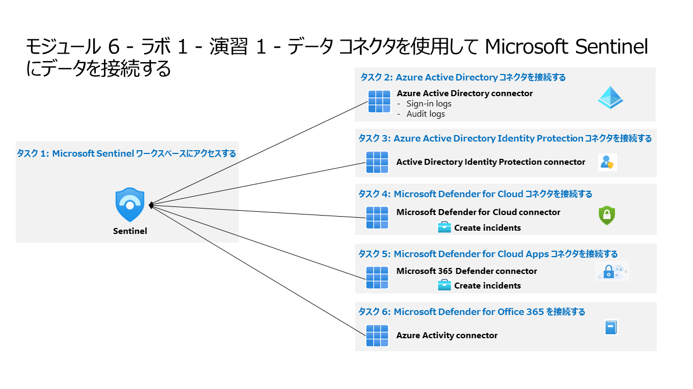

# モジュール 6 - ラボ 1 - 演習 1 - データ コネクタを使用して Microsoft Sentinel にデータを接続する

## ラボ シナリオ

あなたは Microsoft Sentinel を実装した企業で働いているセキュリティ オペレーションアナリストです。組織内の多くのデータ ソースからのログ データを接続する方法について学習する必要があります。組織には、Microsoft 365、Microsoft 365 Defender、Azure リソース、Azure 以外の仮想マシン、ネットワーク アプライアンスからのデータがあります。

あなたは、Microsoft Sentinel データ コネクタを使用して、さまざまなソースからのログ データを統合することを計画しています。組織の各データ ソースを適切な Microsoft Sentinel データ コネクタにマップする管理用のコネクタ計画を作成する必要があります。

>**ノート:** **[interactive lab simulation](https://mslabs.cloudguides.com/guides/SC-200%20Lab%20Simulation%20-%20Connect%20data%20to%20Microsoft%20Sentinel%20using%20data%20connectors)** このラボを自分のペースで確認できます。ホスト型のラボと多少の違いはありますが、主要な概念とアイデアは同じです。

### タスク 1: Microsoft Sentinel ワークスペースにアクセスする。

このタスクでは、Microsoft Sentinel ワークスペースにアクセスします。

1. 管理者として WIN1 仮想マシンにログインします。パスワードは**Pa55w.rd** です。  

2. Microsoft Edge ブラウザーを開きます。

3. Microsoft Edge ブラウザーで Azure portal (https://portal.azure.com) に移動します。

4. **サインイン** ダイアログ ボックスで、ラボ ホスティング プロバイダーから提供された**テナントの電子メール**アカウントをコピーして貼り付け、「**次へ**」を選択します。

5. **パスワードの入力**ダイアログ ボックスで、ラボ ホスティング プロバイダーから提供された**テナントパスワード** をコピーして貼り付け、「**サインイン**」を選択します。

6. Azure portal の検索バーに「**Sentinel**」と入力してから、「**Microsoft Sentinel**」を選択します。

7. 前のラボで作成した Microsoft Sentinel ワークスペースを選択します。

### タスク 2: Microsoft Defender for Cloud コネクタを接続する。

このタスクでは、Microsoft Defender for Cloud コネクタを接続します。

1. 「コンテンツハブ」で、検索ウインドウに「**Microsoft Defender for Cloud**」を入力し、「**Microsoft Defender for Cloud**」を選択します。

1. コネクタ情報ブレードで「**インストール**」を選択します。

1. コネクタ情報ブレードで「**管理**」を選択します。

1. 「**Tenant-based Microsoft Defender for Cloud (Preview)**」を選択し、コネクタ情報ブレードで「**コネクタページを開く**」を選択します。

1. 「接続」ボタンを選択します。

<!--
1. 構成領域の [サブスクリプション] で、[Azure Pass - スポンサー プラン] サブスクリプションのチェック ボックスをオンにし、 **[状態]** オプションを右側にスライドして **[接続済み]** を示します。

1. [状態] が *[接続済み]* になり、[双方向の同期] が *[有効]* になるはずです。

1. 画面右上にある「✖」ボタンを Microsoft Sentinel のナビゲーションメニューが表示されるまでクリックします。

1. 「分析」を選択し、「規則のテンプレート」を選択し、「**Create incidents based on Microsoft Defender for Cloud**」を選択します。

1.  コネクタ情報ブレードで「**ルールの作成**」を選択します。

1. 分析ルール ウィザード で「Next:自動応答>」、「Next:Review and create」、「保存」を選択します。

1. 下にスクロールし、[Create incidents - Recommended!](インシデントの作成 - 推奨) 領域で、 **Enabled** を選択します。 このオプションを選択すると、このサービスに対して分析ルールが自動的に作成されます。 ここで有効にしなくても、後で *[分析]* ブレードを使って、手動で追加したり、構成を変更したりできます。
-->

### タスク 3: Azure アクティビティ コネクタを接続する。

このタスクでは、Azure アクティビティ コネクタを接続します。

1. 「コンテンツハブ」で、検索ウインドウに「**Azure Activity**」を入力し、「**Azure Activity**」コネクタを選択します。

1. コネクタ情報ブレードで「**インストール**」を選択します。

1. コネクタ情報ブレードで「**管理**」を選択します。

1. Azure Activity のコンテンツパックから「**Azure Activity**」コネクタを選択します。

1. コネクタ情報ブレードで「**コネクタページを開く**」を選択します。

1. 構成領域で、「**Azure Policy の割り当てウィザードの起動**」を選択します。

1. **基本**タブで、「**スコープ**」の下で、3 つのドット付きのボタンを選択し、ドロップダウン リストからサブスクリプションを選択して、「**選択**」をクリックします。

1. **パラメーター** タブを選択し、「**プライマリ Log Analytics ワークスペース**」ドロップダウン リストから、Microsoft Sentinel ワークスペースを選択します。

1. 「**修復**」タブを選択し、「**修復タスクの作成**」チェックボックスを選択します。

1. 「**確認および作成**」ボタンを選択して、設定を確認します。

1. 「**作成**」を選択して完了します。

## 演習 2 に進みます。
