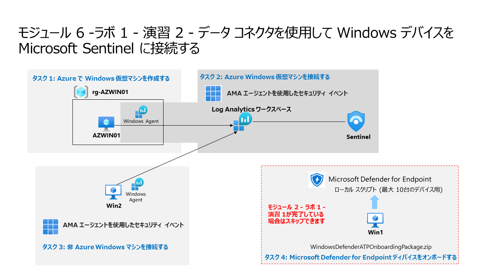

# モジュール 6 -ラボ 1 - 演習 2 - データ コネクタを使用して Windows デバイスを Microsoft Sentinel に接続する

## ラボ シナリオ



あなたは、Microsoft Sentinelを導入した企業に勤務するセキュリティ・オペレーション・アナリストです。あなたは、組織内の多くのデータソースからログデータを接続する方法を学ぶ必要があります。次のデータソースは、オンプレミス環境や他のパブリッククラウドのように、Azureの内外にあるWindows仮想マシンです。

>**ノート:** **[interactive lab simulation](https://mslabs.cloudguides.com/guides/SC-200%20Lab%20Simulation%20-%20Connect%20Windows%20devices%20to%20Microsoft%20Sentinel%20using%20data%20connectors)** このラボを自分のペースで確認できます。ホスト型のラボと多少の違いはありますが、主要な概念とアイデアは同じです。

### タスク 1: Azure で Windows 仮想マシンを作成する

このタスクでは、Azure で Windows 仮想マシンを作成します。

1. 管理者として WIN1 仮想マシンにログインします。パスワードは**Pa55w.rd** です。  

2. Microsoft Edge ブラウザーで Azure portal (https://portal.azure.com) に移動します。

3. **サインイン** ダイアログ ボックスで、ラボ ホスティング プロバイダーから提供された**テナントの電子メール**アカウントをコピーして貼り付け、「**次へ**」を選択します。

4. **パスワードの入力**ダイアログ ボックスで、ラボ ホスティング プロバイダーから提供された**テナントパスワード** をコピーして貼り付け、「**サインイン**」を選択します。

5. 「**+ リソースの作成**」 を選択します。Azure portal をすでに開いている場合は、上部バーから「**Microsoft Azure**」を選択して、ホームに移動することが必要となる可能性があります。

6. 「**サービスとマーケットプレイスの検索**」 ボックスに、「**Windows 10**」と入力します。 

7. **Microsoft Windows10** の**作成**ドロップダウンを選択します。  次に、「**Windows 10 Enterprise, version 22H2**」を選択し、**事前設定された構成で開始する** をクリックします。

8. **開発/テスト** を選択し、**「VMの作成を続行する」** をクリックします。

9.  **リソース グループ** に対して、「**新規作成**」を選択して、名前として **rg-AZWIN01** を入力し、「**OK**」を選択します。

    > **注:** これは、追跡目的の新しいリソース グループである必要があります。  

10. 「**仮想マシン名**」に、**AZWIN01** を入力します。

11. **リージョン**（例：米国東部）を設定します。適切なリージョンが既定になる可能性があります。**可用性オプション** は **インフラストラクチャ冗長は必要ありません** を選択します。サイズは適切なものを選択します。

12. Azure で使用できる **ユーザー名**（例：localadmin）を入力します。

13. 任意の**パスワード**を入力します。 

    > **ヒント:** テナントパスワードを使用するのが最も簡単な方法です。

14. 「**ライセンス**」の下で、チェックボックスを選択します。

15. 「**確認および作成**」を選択します。

16. 「**作成**」 を選択します。リソースが作成されるのを待ちますこれには数分かかることがあります。

### タスク 2: Azure Windows 仮想マシンを接続する。

このタスクでは、Azure Windows 仮想マシンを Microsoft Sentinel に接続します。

1. Azure portal の検索バーに「**Sentinel**」と入力してから、「**Microsoft Sentinel**」を選択します。

2. 先ほど作成した Microsoft Sentinel ワークスペースを選択します。

3. 「コンテンツハブ」で、検索ウインドウに「Windows Security Events」を入力し、「Windows Security Events」を選択します。

4. コネクタ情報ブレードで「インストール」を選択します。

5. コネクタ情報ブレードで「管理」を選択します。

6. 「**Windows Security Events via AMA**」を選択します。

7. コネクタ情報ブレードで「**コネクタページを開く**」を選択します。「データ収集ルールの作成」をクリックします。

8. 「**ルール名**」に、「**AZWIN01DCR**」を入力します。

9. 「**次：リソース**」をクリックします。

10. 「**リソースの追加**」をクリックします。

11. スコープの **rg-AZWIN01** を展開し、**AZWIN01** 仮想マシンを選択し、「**適用**」をクリックします。

12. 「**次：収集**」をクリックして、「**次：確認と作成**」をクリックします。

13. 「**作成**」をクリックします。

14. 数分待って、「最新の情報に更新」をクリックし、データ収集ルールがリストされたことを確認します。

### タスク 3: Azure 以外の Windows マシンを接続する。

このタスクでは、Azure Arcをインストールし、Azure以外のWindows仮想マシンをMicrosoft Sentinelに接続します。

>**重要:** *AMA を使用した Windows セキュリティイベント* データコネクタには、非Azureデバイス用のAzure Arcが必要です。

1. Microsoft Sentinelワークスペースの*AMA を使用した Windows セキュリティイベント* データコネクタの構成にあることを確認します。

1. *構成*セクションで、**データ収集ルールの作成**を選択します。

1. ルール名に**WINServer**と入力し、リソースグループを選択して、**次：リソース**をクリックします。

1. **+リソースの追加** をクリックします。

1. **RG-Defender**（または作成したリソースグループ）を展開し、**WINServer** を選択します。

    >**重要:** WINServer が表示されない場合は、モジュール3、演習 1、タスク 4 で、このサーバーに Azure Arc をインストールしたことを参照してください。

    >**ノート:** 前回の演習では、レガシーなLog Analytics Agentを導入しましたが、今回はデータ収集ルール（DCR）を使用してAzure Monitor Agent（AMA）を導入していきます。

1. 適用をクリックします。

1. 「**次：収集>**」をクリックします。そして、「**次：確認と作成>**」をクリックします。

1. **作成**をクリックします。

1. 1分ほど待ってから**最新の情報に更新**をクリックすると、新しいデータ収集ルールが表示されます。

## 演習 3 に進みます。


<!--
### タスク 3: 非 Azure Windows マシンを接続する。

このタスクでは、非 Azure Windows 仮想マシンを Microsoft Sentinel に接続します。

1. 管理者として WIN2 仮想マシンにログインします。パスワードは**Pa55w.rd** です。  

2. Microsoft Edge ブラウザーを開きます。

3. ブラウザーを開き、以前のラボで使用していた資格情報を使用して、https://portal.azure.com で Azure portral にログインします。

4. Azureポータルの検索ウインドウで、「**Arc**」と入力して、「**Azure Arc**」を選択します。

5. 「インフスラストラクチャ」セクションの「サーバー」を選択します。

6. 「+ 追加」をクリックします。

7. 「単一サーバーの追加」セクションの「スクリプトの生成」をクリックします。

8. 「次へ」をクリックし、「リソースの詳細」タブに移動します。

9. **リソースグループ** を選択します。（例：RG-Defender）

10. 「次へ」をクリックし、タグには何も入力せずそのままの状態を維持します。

11. 「次へ」をクリックし、「スクリプトのダウンロードと実行」タブに移動します。

12. 「**スクリプト**」のコピーをクリックします。

13. Windows のスタートボタンを右クリックして、**Windows PowerShell (管理者)** をクリックします。

14. 「cd C:\Users\Admin\Downloads」を入力します。

15. **Set-ExecutionPolicy -ExecutionPolicy Unrestricted** を入力しEnterキーを押します。

16. 「すべてにはい」の場合は **A** を入力し、Enterキーを押します。

17. コピーしたスクリプトを入力し、実行します。(数分待つ必要があります）

18. スクリプトの進行中に、Auzre アカウントが要求たら既存のアカウントを選択します。ブラウザの別ウィンドウが起動し、「Authentication cmplete」が表示されます。

19. 「**Azure Arcを使用してサーバーを追加**」を閉じます。

20. 「**サーバー**」に **WIN2** サーバー名が表示されるまで「**更新**」を選択します。

21. Microsoft Sentinel に移動します。

22. 「データコネクタ」で「AMA を使用した Windows セキュリティ イベント」を選択します。

23. すでに作成してあるDCR「AZWIN01DCR」の編集ボタンクリックします。

24. 「次：リソース」をクリックします。

25. 「リソースの追加」をクリックします。

26. 「RG-Defender」を展開し、「WIN2」をチェックし、「適用」をクリックします。

27. 「次：収集」をクリックします。

28. 「次：確認と作成」をクリックします。

29. 「作成」をクリックします。

### タスク 4: Sysmonログをインストールして収集します。

このタスクでは、Sysmonログをインストールして収集します。

引き続きWIN2 仮想マシンに接続する必要があります。次の手順では、既定構成でSysmonをインストールします。実稼働マシンで使用する Sysmon のコミュニティベースの構成を調査する必要があります。

1. ブラウザーで新しいタブを開き、https://docs.microsoft.com/sysinternals/downloads/sysmon に移動します

2. 「**Sysmon のダウンロード**」を選択して、ページから Sysmon をダウンロードします。

3. **Sysmon.zip** にカーソルを合わせ、フォルダ－ アイコンを選択します。ダウンロードしたファイルを右クリックして、「**すべて展開...**」を選択し、「**ファイルを下のフォルダーに展開する**」の下で、「**C:\Sysmon**」と入力して、「**展開**」を選択します。 

4. Windows の WIN2 タスクバーの検索ボックスに **command** を入力します。  検索結果には、コマンド プロンプト アプリが表示されます。  コマンド プロンプト アプリを右クリックし、「**管理者として実行**」 を選択します。「**はい**」を選択して、表示されるユーザー アカウント制御ウィンドウで、アプリの実行を許可します。

5. **cd \sysmon** と入力します

6. **notepad sysmon.xml** と入力して、新しいファイルを作成します。「**はい**」を選択して、ファイルの作成を確認します。

7. ブラウザーで新しいタブを開き、https://github.com/SwiftOnSecurity/sysmon-config/blob/master/sysmonconfig-export.xml に移動します

8. 「**Raw**」ボタンを選択し、そのファイルの内容を Github から作成した sysmon.xml メモ帳ファイルにコピーします。「**ファイル**」を選択してから、「**保存**」を選択して、ファイルを保存します。

9. コマンド プロンプトで次のように入力し、Enter キーを押します。
    ```cmd
    sysmon.exe -accepteula -i sysmon.xml
    ```

> **注:**  「構成ファイルが検証されました」および「Sysmon が開始されました」というメッセージが出力に表示されることを確認します。そうならない場合は、データが適切にコピーされ、sysmon.xml が保存されていることを確認します。

10. ブラウザで、https：//portal.azure.com のAzureポータルに戻ります 

11. Azure portal の検索バーに、「**Sentinel**」と入力してから、「**Microsoft Sentinel**」を選択し、以前に作成した Microsoft Sentinel ワークスペースを作成します。

12. Microsoft Sentinelで、構成領域から「**設定**」を選択し、「**ワークスペース設定 >**」タブを選択します

13. Microsoft Sentinel ワークスペースが選択されていることを確認してください。

14. 「設定」フィールドの「**エージェント構成**」を選択します。

15. 「**Windows イベントログ**」タブを選択します。

16. 「**Windows イベントログの追加**」ボタンを選択します。

17. ログ名フィールドに「**Microsoft-Windows-Sysmon/Operational**」と入力します。

18. 「**適用**」を選択します。

### タスク 5: Microsoft Defender for Endpoint ディバイスをオンボードする。

このタスクでは、デバイスを Microsoft Defender for Endpoint にオンボードします。

> **重要:** このコースの最初のモジュールでラボを完了し、仮想マシンを保存した場合は、すでにこのタスクを実行しています。  そのラボ演習と同じ仮想マシンを使用している場合は、このタスクをスキップできます。

1. 管理者として WIN1 仮想マシンにログインします。パスワードは**Pa55w.rd** です。  

2. Microsoft Edge ブラウザーで、Microsoft 365 Defender ポータル (https://security.microsoft.com) にアクセスし、現在ポータルにいない場合は、**テナントの電子メール**資格情報を使用してログインします。

3. 左側のメニュー バーから 「**設定**」 を選択し、「設定」 ページから 「**エンドポイント**」 を選択します。

4. デバイス管理セクションで 「**オンボーディング**」を選択します。

5. 「**パッケージのダウンロード**」を選択します。

6. ダウンロードした.zipファイルを解凍します。

7. **管理者**としてWindowsコマンドプロンプトを実行し、表示されるユーザーアカウント制御プロンプトに同意します。

8. 管理者として抽出したばかりの WindowsDefenderATPLocalOnboardingScript.cmd ファイルを実行します。
 
> **注** 既定では、ファイルは c：\users\admin\downloads ディレクトリにあります。スクリプトの質問に対して「Y」と回答します。 

9. ポータルの「オンボーディング」ページで、検出テスト スクリプトをコピーしてオープン コマンド ウィンドウで実行します。  新しい **管理者: コマンド プロンプト** ウィンドウを開く必要があるかもしれません。Windows 検索バーで「**CMD**」と入力し、「**管理者として実行**」 を選択します。

10. 「エンドポイント」 領域の Microsoft 365 Defender ポータルで、「**デバイス インベントリ**」 を選択します。お使いになっているデバイスがリストに表示されます。
--!>

