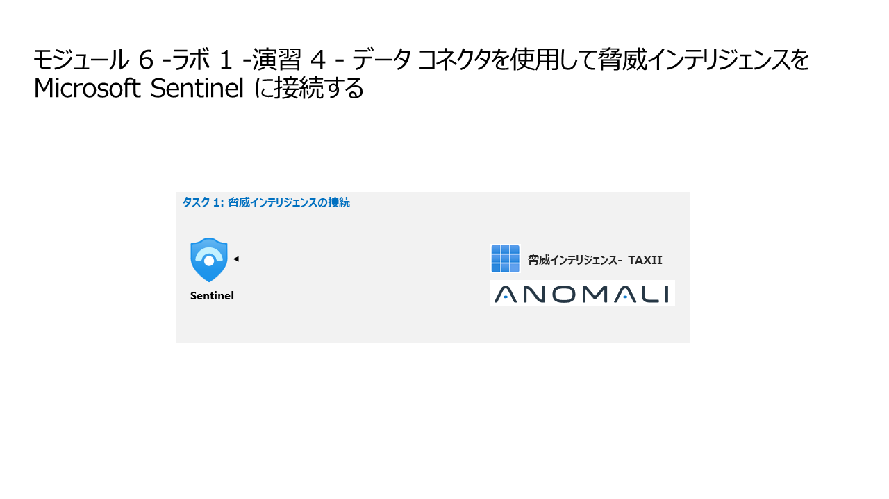

# モジュール 6 -ラボ 1 -演習 4 - データ コネクタを使用して脅威インテリジェンスを Microsoft Sentinel に接続する

**Anomali Limo サービスは2022年8月14日に停止したためこの演習はできません。**

## ラボ シナリオ

あなたは、Microsoft Sentinelを導入した企業に勤務するセキュリティ・オペレーション・アナリストです。あなたは、組織内の多くのデータソースからログデータを接続する方法を学ぶ必要があります。最後に、既知の脅威を検出し、優先順位を付ける能力を強化するために、脅威インテリジェンスフィードを接続する必要があります。

### タスク 1: 脅威インテリジェンスの接続

このタスクでは、脅威インテリジェンス プロバイダーを脅威インテリジェンス - TAXII コネクタに接続します。

1. 管理者として WIN1 仮想マシンにログインします。パスワードは**Pa55w.rd** です。  

2. Microsoft Edgeブラウザーで Azure portal (https://portal.azure.com) に移動します。

3. **サインイン** ダイアログ ボックスで、ラボ ホスティング プロバイダーから提供された**テナントのメール** アカウントをコピーして貼り付け、「**次へ**」を選択します。

4. **パスワードの入力**ダイアログ ボックスで、ラボ ホスティング プロバイダーから提供された**テナントパスワード** をコピーして貼り付け、「**サインイン**」を選択します。

5. Azure portal の検索バーに「**Sentinel**」と入力してから、「**Microsoft Sentinel**」を選択します。

6. 先ほど作成した Microsoft Sentinel ワークスペースを選択します。

7. コンテンツ管理セクションの、**コンテンツハブ** を選択します。

9. コンテンツ ハブで、**Microsoft Defender XDR** ソリューションを検索し、一覧から選択します。

10. **Microsoft Defender XDR** ソリューションの詳細ページで、 **インストール** を選択します。

11. インストールが完了したら、Microsoft Defender XDR ソリューションを検索して選択します。

12. Microsoft Defender XDR ソリューションの詳細ページで、 [管理] を選択します

  >**NOTE:** Microsoft Defender XDR ソリューションでは、Microsoft Defender XDR データ コネクタ、ハンティング クエリ、ブック、分析ルールがインストールされます。

14. Microsoft Defender XDR データ コネクタ　チェック ボックスをオンにし、**コネクタ ページを開く** を選択します。

15. [構成] セクションの [手順] タブで、[これらの製品のすべての Microsoft インシデント作成ルールをオフにする] チェック ボックスの選択を解除します。[推奨] を選択し、 [インシデントとアラートの接続] ボタンを選択します。

16. 接続が成功したことを示すメッセージが表示されます。

## これでラボは完了です。
