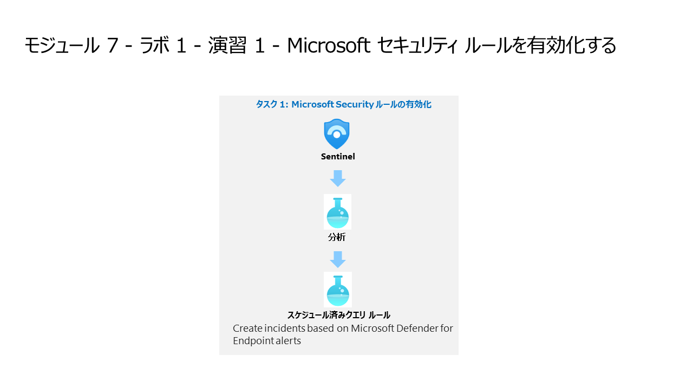

# モジュール 7 - ラボ 1 - 演習 1 - Microsoft セキュリティ ルールを有効化する

## ラボ シナリオ

あなたは、Microsoft Sentinelを導入した企業に勤務するセキュリティ・オペレーション・アナリストです。Microsoft Sentinelを使用して、脅威を検出し、軽減する方法を学ぶ必要があります。まず、Defender for CloudからMicrosoft Sentinelに来るアラートを重要度によってフィルタリングする必要があります。 

### タスク 1: Microsoft Security ルールの有効化

このタスクでは、Microsoft セキュリティルールを有効化します。

1. 管理者として WIN1 仮想マシンにログインします。パスワードは **Pa55w.rd** です。  

2. Microsoft Edgeブラウザーで Azure portal　(https://portal.azure.com) に移動します。

3. **サインイン**ダイアログボックスで、ラボ ホスティング プロバイダーから提供された**テナントの電子メール**アカウントをコピーして貼り付け、「**次へ**」を選択します。

4. **パスワードの入力**ダイアログ ボックスで、ラボ ホスティング プロバイダーから提供された**テナントパスワード** をコピーして貼り付け、「**サインイン**」を選択します。

5. Azure ポータルの検索バーに 「**Sentinel**」 と入力し、「**Microsoft Sentinel**」 を選択します。

6. 前のラボで作成した Microsoft Sentinel ワークスペースを選択します。

7. 構成領域から「**分析**」を選択し、「**アクティブな規則**」を選択します。

8. 「ルール テンプレート」 タブの検索ボックスに、**defender** と入力します。

9. 結果セットで、「**Create incidents based on Microsoft Defender for Cloud**」 を選択します。このルールは、"モジュール 6 - 演習 1 - タスク 4" で構成した Defender for Cloud のコネクタによってアクティブ化されました。

10. 右側のブレードで、「**編集**」ボタンを選択します。

11. **重要度でフィルター処理**を「**カスタム**」ドロップダウンリストを選択します。

12. 重要度 レベルから「**低**」 を選択解除します。

13. 「**次: 自動応答 >**」ボタンを選択し、「**次: レビュー >**」ボタンを選択します。

14. 行った変更を確認し、「**保存**」 ボタンを選択します。分析ルールが保存されます。

# 演習 2 に進みます。
