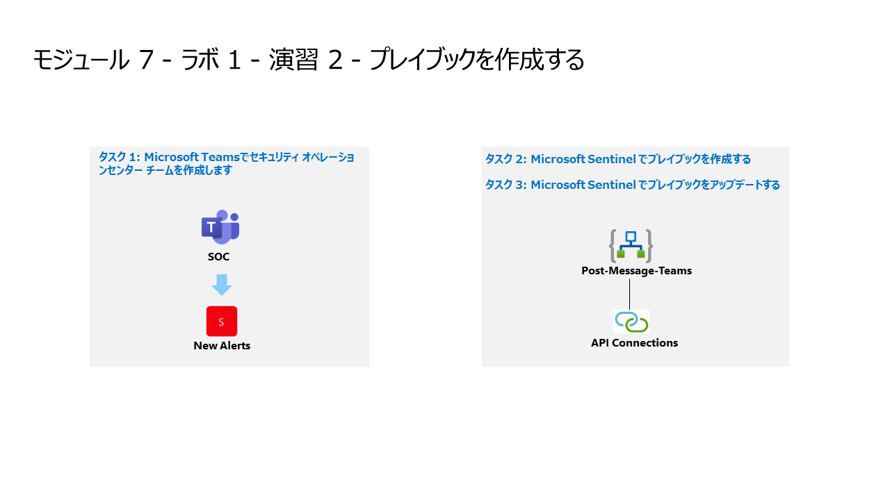

# モジュール 7 - ラボ 1 - 演習 2 - プレイブックを作成する

## ラボ シナリオ

あなたは、Microsoft Sentinelを導入した企業に勤務するセキュリティ・オペレーション・アナリストです。Microsoft Sentinelを使用して、脅威を検出し、軽減する方法を学ぶ必要があります。今、あなたはMicrosoft Sentinelからルーチンとして実行できるアクションに対応したいと思います。

プレイブックを使用すると、脅威対応の自動化と組織化を支援し、社内外の他のシステムと統合し、特定のアラートやインシデントに対応して、それぞれ分析ルールや自動化ルールによってトリガーされたときに自動的に実行するように設定することが可能です。

>**ノート:** **[interactive lab simulation](https://mslabs.cloudguides.com/guides/SC-200%20Lab%20Simulation%20-%20Create%20a%20playbook)** このラボを自分のペースで確認できます。ホスト型のラボと多少の違いはありますが、主要な概念とアイデアは同じです。

### タスク 1: Microsoft Teamsでセキュリティ オペレーションセンター チームを作成します。

このタスクでは、このラボ用のMicrosoft Teamsを作成します。

1. 管理者として WIN1 仮想マシンにログインします。パスワードは**Pa55w.rd** です。  

2. Microsoft Edgeブラウザーで、新しいタグを開き、Microsoft Teams ポータル (https://teams.microsoft.com) に移動します。

3. **サインイン** ダイアログ ボックスで、ラボ ホスティング プロバイダーから提供された**テナントのメール** アカウントをコピーして貼り付け、「**次へ**」を選択します。

4. 「**パスワードの入力**」 ダイアログ ボックスで、ラボ ホスティング プロバイダーから提供された**テナントのパスワード**をコピーして貼り付け、「**サインイン**」 を選択します。

5. 表示される可能性のある Teams ポップアップをすべて閉じます。

6. 左側のメニューで、「**＋**」を選択し、「**チームを作成**」を選択します。

7. 「**最初から**」 ボタンを選択します。

8. 「**プライベート**」ボタンを選択します。

9. チームに**SOC** と名前を付け、「**作成**」 ボタンを選択します。

10. 「SOC にメンバーを追加」画面で、「**スキップ**」 ボタンを選択します。 

11. 新しく作成された SOC チームの横にある **「...」** を選択し、「**チャネルを追加**」を選択します。

12. **新しいアラート**のチャネル名（例：From Sentinel）を入力し、「**追加**」ボタンを選択します。

### タスク 2: Microsoft Sentinel でプレイブックを作成する

このタスクでは、Microsoft Sentinelでプレイブックとして使用されるロジックアプリを作成します。

1. Microsoft Edge ブラウザーで Azure portal (https://portal.azure.com) に移動します。

2. **サインイン** ダイアログ ボックスで、ラボ ホスティング プロバイダーから提供された**テナントのメール** アカウントをコピーして貼り付け、「**次へ**」を選択します。

3. **パスワードの入力**ダイアログ ボックスで、ラボ ホスティング プロバイダーから提供された**テナントパスワード** をコピーして貼り付け、「**サインイン**」を選択します。

4. Azure portal の検索バーに「**Sentinel**」と入力してから、「**Microsoft Sentinel**」を選択します。

5. 先ほど作成した Microsoft Sentinel ワークスペースを選択します。

6. ページの左側にある**コンテンツ管理**領域で、「**コミュニティ**」ページを選択します。

7. 右側のペインで、「**コミュニティのコンテンツをオンボードする**」リンクを選択します。これにより、Microsoft Sentinel GitHub コンテンツに対する新しいタブが Microsoft Edge ブラウザーで開きます。

8. 「**Azure-Sentinel/Solutions/SentinelSOARessentials/Playbooks/**」フォルダーを選択します。

9. 「**Post-Message-Teams**」フォルダーを選択します。

10. readme.md をクリックし、1 番目の**Quick Deployment** オプションである「**Deploy with incident trigger (recommended)**」 (インシデント トリガーを使用してデプロイ) の下に移動し、「**Deploy to Azure**」 (Azure にデプロイ) ボタンを選択します。  

**非常に重要**: これらは、インシデントとアラートを使用するための 2 つの異なる Microsoft Sentinel トリガーであることに注意してください。

11. Azure サブスクリプションが選択されていることを確認してください。

12. リソース グループで、「**新規作成**」を選択し、「**RG-Playbooks**」と入力して、「**OK**」選択します。

13. 領域については、状況に適した領域を選択してください。既定の領域が最適になる可能性があります。

14. **Playbook Name**が "PostMessageTeams" であることを確認して、「**確認と作成**」を選択します。

15. ここで「**作成**」を選択します。

> **注** 次のタスクに進む前に、デプロイが完了するまで待機します。デプロイには数分かかる場合があります。

### タスク 3: Microsoft Sentinel でプレイブックをアップデートする

このタスクでは、作成した新しいプレイブックを適切な接続情報で更新します。

1. Azure portal の検索バーに「**Sentinel**」と入力してから、「**Microsoft Sentinel**」を選択します。

2. Microsoft Sentinel ワークスペースを選択します。

3. 構成領域から「**オートメーション**」を選択してから、「**アクティブなプレイブック**」タブを選択します。

4. **PostMessageTeams** プレイブックのリンクを選択します。

5. **PostMessageTeams** で「**ロジックアプリデザイナー**」を選択します。

6. 「**Microsoft Sentinel incident（プレビュー）**」ブロックを選択します。

7. 「**接続を変更してください**」リンクを選択します。

8. 「**新規追加**」を選択し、「**サインイン**」を選択します。新しいウィンドウで、プロンプトが表示されたら、Azure サブスクリプション管理者の資格情報を使用してサインインします。

12. 次に、Teamsの「**接続**」ブロックを選択します。

13. 「**新規追加**」を選択し、プロンプトが表示されたら、Azure サブスクリプション管理者の資格情報を選択します。

14. 次に、「**メッセージの投稿 (V3)**」ブロックの チーム ボックスの最後にある「**X**」を選択して、内容を消去します。編集ボックスは、Microsoft Teams から利用可能なチームのリストを含むドロップダウンに変更されます。  「**SOC**」を選択します。

15. チャンネルにも同様の操作を行い、編集ボックスの最後にある「**X**」を選択して、内容を消去します。編集ボックスは、チームのリストを含むドロップダウンに変更されます。先ほど作成した新しいチャネル名を選択します。

16. コマンド バーの「**保存**」を選択します。
17. 右上の「✖」をクリックしてオートメーションメニューに戻ります。

これらは後のラボで使用します。

## 演習 3 に進みます。
