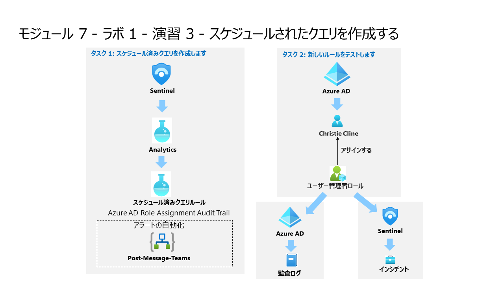

# モジュール 7 - ラボ 1 - 演習 3 - スケジュールされたクエリを作成する

## ラボ シナリオ

<!--

--!>

あなたは、Microsoft Sentinelを導入した企業に勤務するセキュリティ・オペレーション・アナリストです。Microsoft Sentinelを使用して、脅威を検出し、軽減する方法を学ぶ必要があります。データソースをMicrosoft Sentinelに接続した後、カスタム分析ルールを作成して、環境内の脅威と異常な動作を発見するのに役立ちます。

分析ルールは、環境全体で特定のイベントまたはイベントのセットを検索し、特定のイベントの閾値または条件に達するとアラートして、SOCがトリアージと調査を行うためのインシデントを生成し、自動追跡と再メディエーションプロセスによって脅威に対応します。

>**ノート:** **[interactive lab simulation](https://mslabs.cloudguides.com/guides/SC-200%20Lab%20Simulation%20-%20Create%20a%20scheduled%20query)** このラボを自分のペースで確認できます。ホスト型のラボと多少の違いはありますが、主要な概念とアイデアは同じです。

### タスク 1: スケジュール済みクエリを作成します。

このタスクでは、スケジュールされたクエリを作成し、前の演習で作成した Teams チャネルに接続します。

1. 管理者として WIN1 仮想マシンにログインします。パスワードは**Pa55w.rd** です。  

2. **サインイン** ダイアログ ボックスで、ラボ ホスティング プロバイダーから提供された**テナントのメール** アカウントをコピーして貼り付け、「**次へ**」を選択します。

3. **パスワードの入力**ダイアログ ボックスで、ラボ ホスティング プロバイダーから提供された**テナントパスワード** をコピーして貼り付け、「**サインイン**」を選択します。

4. Azure portal の検索バーに「*Sentinel*」と入力してから、「**Microsoft Sentinel**」を選択します。

5. Azure Sentinel ワークスペースを選択します。

6. 構成領域から「**分析**」を選択します。

7. コマンド バーの 「規則のテンプレート」タブが表示されていることを確認し、「New CloudShell User」ルールを検索します。

8. ルールの概要ブレードで、「Data sources:Azure Activity」の下にある緑色のアイコンを確認して、データを受信していることを確認します。

9. 「ルールの作成」を選択して続行します。

10. 分析ルール ウィザードの「全般」タブで、「重大度」を「中」に変更します。

11. 「次へ: ルールのロジックを設定」ボタン>を選択します。

12. ルール クエリの場合は、「クエリ結果の表示」を選択します。結果もエラーも表示されないはずです。

13. 右上の 「X」 を選択して「ログ」ウィンドウを閉じ、「OK」を選択して破棄し、変更を保存してウィザードに戻ります。

14. 下にスクロールし、「クエリ スケジュール」で次のように設定します。

    |設定|値|
    |---|---|
    |クエリの実行間隔|5 分|
    |次の時間分の過去のデータを参照します|1 日|

15. 「アラートしきい値」領域で、アラートですべてのイベントを登録するため、値を変更しないでおきます。

16. 「イベントグループ化」領域で、クエリが上記の指定されたアラートしきい値よりも多くの結果を返す限り、実行するたびに 1 つのアラートを生成するため、「すべてのイベントを単一のアラートにグループ化する」オプションを選択したままにします。

17. 「次へ: インシデント設定 >」 ボタンを選択します。

18. 「インシデントの設定」タブで、既定のオプションを確認します。

19. 「次へ: 自動応答>」ボタンを選択します。

20. 「自動応答」タブの「自動化ルール」で、「**新規追加**」を選択します。

21. 「オートメーションルール名」に「**Tier 2**」と入力します。

22. 「アクション」で、「所有者の割り当て」を選択します。

23. 次に、「自分への割り当て] を選択します。次に、「適用」を選択します。

24. 下にスクロールして、アラートのオートメーション (クラシック) バーを選択します。

25. ドロップダウン メニューから、前の演習で作成したプレイブックの PostMessageTeams-OnAlert を選択します。

26. 「次へ: >の確認」ボタンを選択します。

27. 「作成」を選択します。

### タスク 2: 新しいルールをテストします。

このタスクでは、新しいスケジュールされたクエリルールをテストします

1. Azure ポータルのトップ バーで、CloudShell に対応するアイコン >_ を選択します。ディスプレイの解像度が低すぎる場合は、最初に省略記号アイコン (...) を選択する必要があります。

2. 「Powershell」を選択し、「ストレージの作成」を選択します。CloudShell がプロビジョニングされるまで待ちます。

3. Azure CloudShell ウィンドウを閉じます。

4. Azure ポータルの検索バーに「アクティビティ」と入力し、「アクティビティ ログ」を選択します。

5. 「操作名」項目 「List Storage Account Keys」と「Update Storage Account Create」が表示されていることを確認します。これらは、前に確認した KQL クエリがアラートを生成するために一致する操作です。ヒント：リストを更新するには、「最新の情報に更新」を選択する必要がある場合があります。

6. Azure portal の検索バーに「Sentinel」と入力し、「Microsoft Sentinel」を選択します。

7. Microsoft Sentinel ワークスペースを選択します。

8. 「脅威管理」の下の「インシデント」メニュー オプションを選択します。

9. 「自動更新：インシデント」トグルを選択します。

10. 新しく作成されたインシデントが表示されます。

11. インシデントを選択し、右側のブレードで情報を確認します。

12. Edgeブラウザーでタブを選択してMicrosoft Teamsに戻ります。閉じた場合は、新しいタブを開いて https://teams.microsoft.com と入力するだけです。SOC Teams に移動し、新しいアラート チャネルを選択して、インシデントに関するメッセージ投稿を確認します。

## 演習 4 に進みます。

<!--
1. Azureポータルの検索バーに「*Azure Active Directory*」と入力します。「**Azure Active Directory**」を選択します。

2. 管理領域で「**ユーザー**」を選択し、"ユーザー | すべてのユーザー (プレビュー)" ページが表示されるようにします。

3. リストからユーザー「**Christie Cline**」を選択すると、"Christie Cline の | プロファイル" ページが表示されます。

4. 管理領域で「**割り当てられたロール**」を選択し、"Christie Cline | 割り当てられたロール" ページが表示されます。

5. コマンド バーから「**+ 割り当ての追加**」を選択します。

6. **ディレクトリロール** で、「**ユーザー管理者**」を選択し、「**追加**」を選択します。

7. 割り当ての完了に失敗した場合は、再試行してください。

8. "Christie Cline | の割り当てられたロール" と "ユーザー | すべてのユーザー (プレビュー)" ページを右上の「x」を 2 回選択して閉じます。

9. "Contoso | の概要" ページの「*監視*」の下で、「**監査ログ**」を選択します。

10. 「**データ設定のエクスポート**」を選択して、"Azure Active Directory" のデータ コネクタが、Sentinel で正しく設定されていることを確認します。

11. Sentinel に対して以前に作成した *Log Analytics ワークスペース*の*診断設定*エントリがあることを確認します。

12. 右上の「x」を選択して、ページを閉じます。

13. 「**更新**」をクリックして以前に作成したロールに変更を示す **カテゴリ** に **RoleManagement** に対するエントリが表示されるのを確認します。

14. Azure portal の検索バーに「*Sentinel*」と入力してから、「**Microsoft Sentinel**」を選択します。

15. Microsoft Sentinel ワークスペースを選択します。

16. **インシデント** メニュー オプションを選択します。

> **注:** トリガーされたアラートの処理には 5 分以上かかる場合があります。次の演習を続けて、後でこのポイントに戻ることができます。インシデント ページの自動更新については、「**Auto-refresh incidents**」 (自動更新:インシデント) トグルを選択します。

17. 新しく作成したインシデントが表示されます。インシデントを選択し、右側のブレードの情報を確認します。

18. ブラウザー タブを開き、https://teams.microsoft.com にアクセスして、Microsoft Teams を開きます。*SOC* チームに移動し、インシデントに関するメッセージ投稿を参照してください。

## 演習 4 に進みます。

--!>
