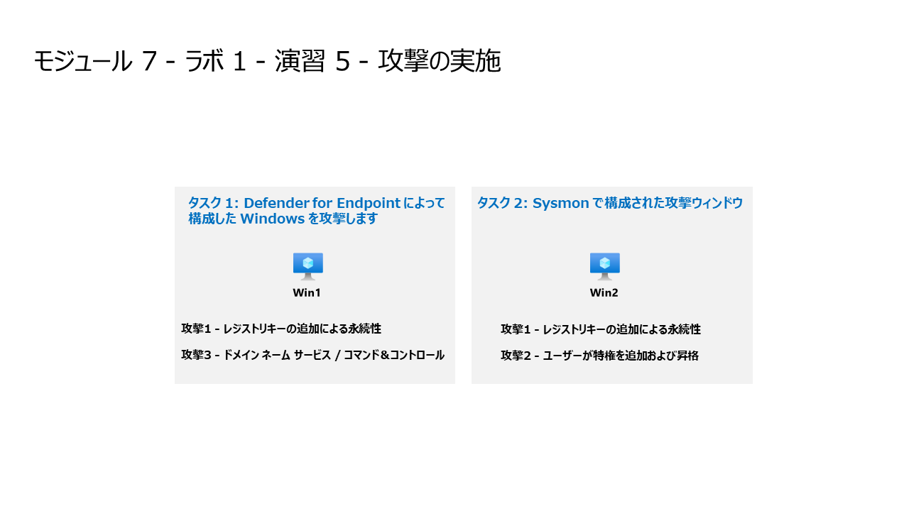

# モジュール 7 - ラボ 1 - 演習6  - 攻撃の実施

## ラボ シナリオ



後にMicrosoft Sentinelで検知・調査するために使用する攻撃をシミュレートすることになります。

>**ノート:** **[interactive lab simulation](https://mslabs.cloudguides.com/guides/SC-200%20Lab%20Simulation%20-%20Perform%20simulated%20attacks)** このラボを自分のペースで確認できます。ホスト型のラボと多少の違いはありますが、主要な概念とアイデアは同じです。

### タスク 1: レジストリ キーの追加による永続化攻撃

1. 管理者として WINServer 仮想マシンにログインします。パスワードは**Pa55w.rd** です。  

1. タスク バーの検索で、*Command* と入力します。  検索結果にコマンド プロンプトが表示されます。  コマンド プロンプトを右クリックして、**「管理者として実行」** を選択します。表示されるユーザー アカウント制御ウィンドウで、「**はい**」を選択して、アプリの実行を許可します。

1. コマンドプロンプトで、各行の後に Enter キーを押して、各行にコマンドを入力します。（WinServerの監査設定を行います）

    ```
    auditpol /set /subcategory:"Registry" /success:enable /failure:enable
    auditpol /set /subcategory:"Process Creation" /success:enable /failure:enable
    auditpol /set /subcategory:"Security Group Management" /success:enable /failure:enable
    auditpol /get /category:*
    ```
    
1. コマンドプロンプトで、各行の後に Enter キーを押して、各行にコマンドを入力します。

    ```
    cd \
    mkdir temp
    cd temp
    ```

1. このコマンドをコピーして実行します。

    ```
    REG ADD "HKCU\SOFTWARE\Microsoft\Windows\CurrentVersion\Run" /V "SOC Test" /t REG_SZ /F /D "C:\temp\startup.bat"
    ```

### タスク 2: ユーザー追加による特権昇格攻撃

1. このコマンドをコピーして実行し、各行の後に Enter キーを押して各行にコマンドを入力します。

    ```CommandPrompt
    net user theusernametoadd /add
    net user theusernametoadd ThePassword1!
    net localgroup administrators theusernametoadd /add
    ```
    > WINServerのラボ環境のログは反映されるまでに時間がかかる場合があります。AZWIN01の仮想マシンでも同様のコマンドを実行しておくと次の演習がスムーズに進む場合があります。

### タスク 3: DNSによるコマンドとコントロール攻撃

1. 次のコマンドをコピーして実行し、C2 サーバーへの DNS クエリをシミュレートするスクリプトを作成します。

    ```
    notepad c2.ps1
    ```

1. 「**はい**」を選択して新しいファイルを作成し、以下の PowerShell スクリプトを *c2.ps1* にコピーします。

    **注:** 仮想マシンへの貼り付けには長さの制限がある場合があります。手順から直接コピーできない場合は、これを 3 つのセクションに貼り付けて、すべてのスクリプトが仮想マシンに貼り付けられるようにします。  スクリプトがメモ帳 *c2.ps1* ファイル内のこれらの手順のように見えることを確認してください。

    ```
    param(
        [string]$Domain = "microsoft.com",
        [string]$Subdomain = "subdomain",
        [string]$Sub2domain = "sub2domain",
        [string]$Sub3domain = "sub3domain",
        [string]$QueryType = "TXT",
            [int]$C2Interval = 8,
            [int]$C2Jitter = 20,
            [int]$RunTime = 240
    )

    $RunStart = Get-Date
    $RunEnd = $RunStart.addminutes($RunTime)

    $x2 = 1
    $x3 = 1 
    Do {
        $TimeNow = Get-Date
        Resolve-DnsName -type $QueryType $Subdomain".$(Get-Random -Minimum 1 -Maximum 999999)."$Domain -QuickTimeout

        if ($x2 -eq 3 )
        {
            Resolve-DnsName -type $QueryType $Sub2domain".$(Get-Random -Minimum 1 -Maximum 999999)."$Domain -QuickTimeout
            $x2 = 1
        }
        else
        {
            $x2 = $x2 + 1
        }
        
        if ($x3 -eq 7 )
        {
            Resolve-DnsName -type $QueryType $Sub3domain".$(Get-Random -Minimum 1 -Maximum 999999)."$Domain -QuickTimeout
            $x3 = 1
        }
        else
        {
            $x3 = $x3 + 1
        }

        $Jitter = ((Get-Random -Minimum -$C2Jitter -Maximum $C2Jitter) / 100 + 1) +$C2Interval
        Start-Sleep -Seconds $Jitter
    }
    Until ($TimeNow -ge $RunEnd)
    ```

1. メモ帳のメニューで、「**ファイル**」を選択してから、「**上書き保存**」を選択します。コマンド プロンプト ウィンドウで、次のコマンドを入力し、各行の後に Enter キーを押して各行にコマンドを入力します。

    >**注:** DNS名前解決エラーが表示されます。これは予測されていることです。

    ```CommandPrompt
    PowerShell.exe -file c2.ps1
    ```

    >**重要:** ウィンドウを閉じないでください。このコマンド/パワーシェルスクリプトをバックグラウンドで実行します。コマンドは、数時間ログエントリを生成する必要があります。このスクリプトの実行中に次のタスクや次の演習に進むことができます。このタスクで作成したデータは、後で脅威の捜索ラボで使用します。このプロセスでは、大量のデータや処理を作成することはありません。

## 演習 7 に進みます。
