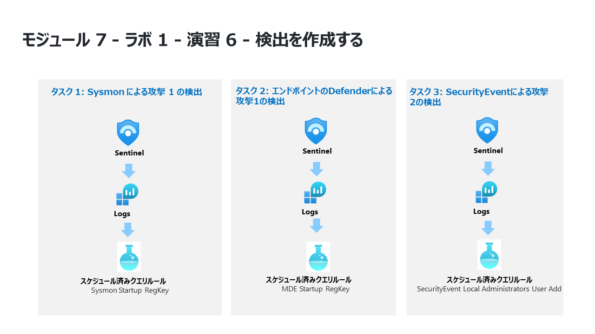

# モジュール 7 - ラボ 1 - 演習 7 - 検出を作成する

## ラボ シナリオ

<!--  -->

あなたは、Microsoft Sentinelを導入した企業で働くセキュリティオペレーションアナリストです。Log AnalyticsのKQLクエリを使用して、そこからカスタム分析ルールを作成し、環境内の脅威や異常な動作を発見するのに役立てようとします。

分析ルールは、環境全体の特定のイベントまたはイベントのセットを検索し、特定のイベントのしきい値または条件に達したときにアラートを表示し、SOC がトリアージおよび調査するためのインシデントを生成し、自動化された追跡および修復プロセスで脅威に対応します。

<!--
### タスク 1: Sysmon による攻撃 1 の検出

このタスクでは、セキュリティ イベント コネクタと Sysmon がインストールされているホストで**攻撃 1** の検出を作成します。

1. 管理者として WIN1 仮想マシンにログインします。パスワードは**Pa55w.rd** です。  

2. Microsoft Edge ブラウザーで Azure portal (https://portal.azure.com) に移動します。

3. **サインイン**ダイアログ ボックスで、ラボのホスティングプロバイダーから提供された管理者用の**テナント電子メール**アカウントをコピーして貼り付け、**次へ**を選択します。

4. **パスワードの入力**ダイアログ ボックスで、ラボ ホスティング プロバイダーから提供された管理者用の**テナントパスワード**をコピーして貼り付け、「**サインイン**」 を選択します。

5. Azure portal の検索バーに「*Sentinel*」と入力してから、「**Microsoft Sentinel**」を選択します。

6. 先ほど作成した Azure Sentinel ワークスペースを選択します。

7. 全般 セクションから**ログ**を選択します。

8. まず、データが保存されている場所を確認する必要があります。攻撃を行ったばかりなので  ログの時間範囲を**過去24時間**に設定します。

9. 次のKQLステートメントを実行します

```KQL
search "temp\\startup.bat"
```

10. 結果は、3つの異なるテーブルについて示しています。
- DeviceProcessEvents
- DeviceRegistryEvents
- Event

    **Device** テーブルは、Defender for Endpoint コネクタに由来します。**Event** テーブルのデータは、エージェント構成を通して接続された Sysmon/Operational Windows Event Logs から入力されます。

    Sysmon と Defender for Endpoint の 2 つの異なるソースからデータを受信しているため、後で結合できる 2 つの KQL ステートメントを作成する必要があります。最初の調査では、それぞれを個別に確認していきます。

  > **注:** まれに、データの読み込みプロセスの読み込みに通常よりも時間がかかる場合があります。その場合、テーブルがクエリに数時間表示されないことがあります。**Event** テーブルが表示された場合のみ、続行できます。

11. 最初のデータソースは、WindowsホストからのSysmonです。以下のKQLステートメントを実行します。

```KQL
search in (Event) "temp\\startup.bat"
```
結果は、イベントテーブルに対してのみ表示されるようになりました。  

12. 行を展開して、レコードに関連するすべての列を表示します。  EventDataやParameterXmlなどのいくつかのフィールドには、構造化データとして保存された複数のデータ項目があります。これにより、特定のフィールドでのクエリが困難になります。  

13. 次に、各行のデータを解析するKQLステートメントを作成して、意味のあるフィールドを作成する必要があります。GitHubのAzureSentinelコミュニティでは、ParsersフォルダーにParsersの例が多数あります。ブラウザーで新しいタブを開き、以下に移動します。**https://github.com/Azure/Azure-Sentinel**

14. **Parsers**フォルダーを選択し、次に**Sysmon**フォルダーを選択します。

15. Sysmon-v12.0.txtファイルを選択し確認します。

ファイルの先頭に、Eventテーブルをクエリし、EventDataという名前の変数に格納するLetステートメントが表示されます。
> **ヒント:** 次のコード スニペットは、手順 16 のクエリを理解しやすくすることを目的としています。コピーしたり、実行したりしないでください。

```
let EventData = Event
| where Source == "Microsoft-Windows-Sysmon"
| extend RenderedDescription = tostring(split(RenderedDescription, ":")[0])
| project TimeGenerated, Source, EventID, Computer, UserName, EventData, RenderedDescription
| extend EvData = parse_xml(EventData)
| extend EventDetail = EvData.DataItem.EventData.Data
| project-away EventData, EvData  ;
```

ファイルのさらに下に、EventID == 13を調べ、EventData変数を入力として使用している別のletステートメントがあります。  
**ヒント:** 次のコード スニペットは、手順 16 のクエリを理解しやすくすることを目的としています。コピーしたり、実行したりしないでください。

```
let SYSMON_REG_SETVALUE_13=()
{
    let processEvents = EventData
    | where EventID == 13
    | extend RuleName = EventDetail.[0].["#text"], EventType = EventDetail.[1].["#text"], UtcTime = EventDetail.[2].["#text"], ProcessGuid = EventDetail.[3].["#text"], 
    ProcessId = EventDetail.[4].["#text"], Image = EventDetail.[5].["#text"], TargetObject = EventDetail.[6].["#text"], Details = EventDetail.[7].["#text"]
    | project-away EventDetail  ;
    processEvents;
    
};
```
これは良いスタートのように見えます。

16. 上の 2 つのステートメントにより、Event テーブル内の Sysmon を使用して、すべての Registry Key Set Value 行を表示するための独自の KQL ステートメントを作成します。次の KQL クエリを実行します。

**重要:** エラーを防止するため、最初に KQL クエリを*メモ帳*に貼り付けてから、*新しいクエリ 1* のログ ウィンドウにコピーしてください。

```KQL
Event
| where Source == "Microsoft-Windows-Sysmon"
| where EventID == 13
| extend RenderedDescription = tostring(split(RenderedDescription, ":")[0])
| project TimeGenerated, Source, EventID, Computer, UserName, EventData, RenderedDescription
| extend EvData = parse_xml(EventData)
| extend EventDetail = EvData.DataItem.EventData.Data
| project-away EventData, EvData  
| extend RuleName = EventDetail.[0].["#text"], EventType = EventDetail.[1].["#text"], UtcTime = EventDetail.[2].["#text"], ProcessGuid = EventDetail.[3].["#text"], 
    ProcessId = EventDetail.[4].["#text"], Image = EventDetail.[5].["#text"], TargetObject = EventDetail.[6].["#text"], Details = EventDetail.[7].["#text"]
    | project-away EventDetail 
```

   

17. ここから引き続き検出ルールを作成できますが、このKQLステートメントは、他の検出ルールのKQLステートメントで再利用できるように見えます。  「ログ」ウィンドウで、「**保存**」、「**関数として保存**」の順に選択します。「保存」 フライアウトで、次のように入力して関数を保存します。
 
|設定|値|
|:----|:----|
|関数名|Event_Reg_SetValue|
|カテゴリ|Sysmon|

18. 「**保存**」を選択し、「+」記号を選択して、新しいログ クエリ タブを開きます。次に、以下の KQL ステートメントを実行します。

```KQL
Event_Reg_SetValue
```
現在のデータ収集によっては、多くの行を受け取る可能性があります。  これは予測されていることです。  次のタスクは、特定のシナリオにフィルターをかけることです

19. 以下の　KQL　ステートメントを実行します。

```KQL
Event_Reg_SetValue | search "startup.bat"
```
これにより、特定のレコードが返され、データを確認して、行を識別するために何を変更できるかを確認できます

20. 脅威インテリジェンスから、脅威アクターがreg.exeを使用してレジストリキーを追加していることがわかります。ディレクトリは c:\temp です。startup.bat は別の名前にすることができます。次のスクリプトを実行します。

```KQL
Event_Reg_SetValue 
| where Image contains "reg.exe"

```
これは良いスタートです  次に、c:\temp ディレクトリの結果のみを返す必要があります。

21. 続いて、以下のKQLステートメントを実行します:

```KQL
Event_Reg_SetValue 
| where Image contains "reg.exe"
| where Details startswith "C:\\TEMP"
```

これは良い検出ルールのように見えます。  

22. アラートについてできるだけ多くのコンテキストを提供することにより、セキュリティ運用アナリストを支援することが重要です。これには、調査グラフで使用するエンティティの投影が含まれます。次のクエリを実行します。

```KQL
Event_Reg_SetValue 
| where Image contains "reg.exe"
| where Details startswith "C:\\TEMP"
| extend timestamp = TimeGenerated, HostCustomEntity = Computer, AccountCustomEntity = UserName
```

23. 適切な検出ルールができたので、クエリのあるログウィンドウで、コマンド バーの 「**新しいアラート ルール**」 を選択し、「**Azure Sentinel アラートの作成**」 を選択します。

24. これにより、分析ルール ウィザードが起動します。全般タブに次のように入力します

|設定|値|
|:----|:----|
|名前 |Sysmon Startup RegKey|
|説明 |Sysmon Startup Regkey in c:\temp|
|戦術 |Persistence|
|重大度 |高|

「**次: ルール ロジックの設定 >**」を選択します。

25. 「**ルール ロジックの設定**」 タブで、**ルール クエリ** が既に入力されているはずです。さらに「アラートエンリッチメント」セクションの **エンティティマッピング** を確認し、エンティティが既に入力されている必要があります。

26. **クエリのスケジューリング設定** で、次のように設定します。

|設定|値|
|:----|:----|
|クエリの実行間隔 |5 分|
|次の時間分の過去のデータを参照します |1 日|

> **注:** 同じデータに対して意図的に多くのインシデントを生成しています。これにより、ラボはこれらのアラートを使用できるようになります。この構成変更を行うと、受信するアラートの数が変化する場合があります。

27. 残りのオプションは既定値のままにします。「**次: インシデント設定 >**」ボタンを選択します。

28. **インシデントの設定 (プレビュー)** タブで、これらの構成が次のように設定されていることを確認します。 

|設定|値|
|:----|:----|
|インシデントの設定 |有効|
|アラートのグループ化 |無効|

「**次: 自動応答 >**」ボタンを選択します。

29. 自動応答タブで次のように設定します。

- **PostMessageTeams-OnAlert** を選択します。

30. 「**次: レビュー**」ボタンを選択します。

31. **確認と作成** タブで、**作成**を選択します。
-->

### タスク 1: Defender for Endpoint による攻撃1の検出

このタスクでは、Microsoft Defender for Endpoint が構成されたホストで**攻撃 1** の検出を作成します。

1. Microsoft Sentinelポータルで、全般セクションから**ログ**を選択します。

2. 以下の　KQL　ステートメントを実行します。

```KQL
search
```

3. 以下の　KQL　ステートメントを実行します。これは Defender for Endpoint からのデータに焦点を当てています。

```KQL
search in (Device*) "temp\\startup.bat"
```

4. DeviceRegistryEvents テーブルは、データが既に正規化されていて、クエリが簡単であるように見えます。行を展開すると、レコードに関連するすべての列が表示されます。

　> **注:** クエリ結果に DeviceRegistryEvents テーブルが表示されない場合は、次の 2 つのクエリの代わりに、DeviceProcessEvents テーブルを置換として使用する方法があります。つまり、前のクエリで表示されたテーブルに応じて、以下の 2 つの例のいずれかを使用します。

5. クエリ結果から、脅威アクターが reg.exe を使用してレジストリ キーにキーを追加し、プログラムが C:\temp にあることがわかります。次のステートメントを実行して、検索演算子をクエリの where 演算子に置き換えます。

```KQL
DeviceRegistryEvents
| where ActionType == "RegistryValueSet"
| where InitiatingProcessFileName == "reg.exe"
| where RegistryValueData startswith "c:\\temp"
```
または、DeviceProcessEvents テーブルを使用して次の KQL クエリを実行することもできます。

```KQL
DeviceProcessEvents | where ActionType == "ProcessCreated"
| where FileName == "reg.exe"
| where ProcessCommandLine contains "c:\\temp"
```

6. アラートについてできるだけ多くのコンテキストを提供することにより、セキュリティオペレーションセンターアナリストを支援することが重要です。これには、調査グラフで使用するエンティティの投影が含まれます。次のクエリを実行します。

```KQL
DeviceRegistryEvents
| where ActionType == "RegistryValueSet"
| where InitiatingProcessFileName == "reg.exe"
| where RegistryValueData startswith "c:\\temp"
| extend timestamp = TimeGenerated, HostCustomEntity = DeviceName, AccountCustomEntity = InitiatingProcessAccountName
```

   

または、DeviceProcessEvents テーブルを使用して次の KQL クエリを実行することもできます。

```KQL
DeviceProcessEvents | where ActionType == "ProcessCreated"
| where FileName == "reg.exe"
| where ProcessCommandLine contains "c:\\temp"
| extend timestamp = TimeGenerated, HostCustomEntity = DeviceName, AccountCustomEntity = InitiatingProcessAccountName
```

7.  適切な検出ルールができたので、クエリのあるログ ウィンドウで、コマンド バーの 「**新しいアラート ルール**」 を選択します。  次に、「**Microsoft Sentinel アラートの作成**」 を選択します。

8. これにより、分析ルール　ウィザードが起動します。全般タブに次のように入力します

|設定|値|
|:----|:----|
|名前 |MDE Startup RegKey|
|説明 |MDE Startup Regkey in c:\temp|
|戦術 |Persistence|
|重大度 |高|

9. 「**次: ルール ロジックを設定　>**」ボタンを選択します。

10. 「**ルール ロジックの設定**」 タブで、**ルール クエリ** が既に入力されているはずです。さらに「アラートエンリッチメント」セクションの **エンティティマッピング** を確認し、エンティティが既に入力されている必要があります。

11. **クエリのスケジューリング設定** で、次のように設定します。

|設定|値|
|:----|:----|
|クエリの実行間隔 |5 分|
|次の時間分の過去のデータを参照します |1 日|

> **注:** 同じデータに対して意図的に多くのインシデントを生成しています。  これにより、ラボはこれらのアラートを使用できるようになります。

12. 残りのオプションは既定値のままにします。「**次: インシデントの設定 >**」を選択します。

13. **インシデントの設定** タブで、既定値のままにして、「**次: 自動応答 >」を選択します。**

14. 自動応答タブで、「アラートのオートメーション（クラッシック）」の下で、**PostMessageTeams-OnAlert** を選択します。「**次: レビュー >**」ボタンを選択します。

15. **確認と応答** タブで、**作成** を選択します。

### タスク 2: SecurityEventによる攻撃2の検出

このタスクでは、セキュリティ イベント コネクタがインストールされているホスト上の **攻撃 2 (Win2)** の検出を作成します。

1. Microsoft Sentinel メニューの 全般 セクションで **ログ** を選択します。

2. 以下の　KQL　ステートメントを実行します。

```KQL
search "administrators" | summarize count() by $table
```

3. 最初のデータソースはSecurityEventです。特権グループへのメンバーの追加を識別するためにWindowsが使用するイベントIDを調査するときが来ました。探していた EventID と Event は "4732 - A member was added to a security-enabled local group" でした。次のスクリプトを実行して確認します。

```KQL
SecurityEvent
| where EventID == "4732"
| where TargetAccount == "Builtin\\Administrators"
```

4. 行を展開して、レコードに関連するすべての列を表示します。  探しているユーザー名は表示されません。  問題は、ユーザー名を保存する代わりに、セキュリティ識別子 (SID) が保存されるということです。次の KQL は、SID を照合して、Administrators グループに追加された TargetUserName にデータを入力しようとします。

```KQL
SecurityEvent
| where EventID == "4732"
| where TargetAccount == "Builtin\\Administrators"
| extend Acct = MemberSid, MachId = SourceComputerId 
| join kind=leftouter (
     SecurityEvent 
     | summarize count() by TargetSid, SourceComputerId, TargetUserName
     | project Acct1 = TargetSid, MachId1 = SourceComputerId, UserName1 = TargetUserName
) on $left.MachId == $right.MachId1, $left.Acct == $right.Acct1 
```

   

> **注:** ラボで使用されるデータセットが小さいため、このKQLは期待される結果を返さない場合があります。

5. 行を拡張して結果の列を表示すると、最後の列には、KQL クエリ内に表示される UserName1 列の下に追加されたユーザーの名前が表示されます。セキュリティ運用アナリストは、アラートに関するコンテキストをできるだけ多く提供することで、セキュリティ運用アナリストを支援することが重要です。これには、調査グラフで使用するエンティティの表示が含まれます。次のクエリを実行します。

```KQL
SecurityEvent
| where EventID == "4732"
| where TargetAccount == "Builtin\\Administrators"
| extend Acct = MemberSid, MachId = SourceComputerId 
| join kind=leftouter (
     SecurityEvent 
     | summarize count() by TargetSid, SourceComputerId, TargetUserName
     | project Acct1 = TargetSid, MachId1 = SourceComputerId, UserName1 = TargetUserName
) on $left.MachId == $right.MachId1, $left.Acct == $right.Acct1 
| extend timestamp = TimeGenerated, HostCustomEntity = Computer, AccountCustomEntity = UserName1
```

6. 適切な検出ルールができたので、クエリのあるログ ウィンドウで、コマンド バーの 「**新しいアラート ルール**」 を選択し、「**Azure Sentinel アラートの作成**」 を選択します。

7. これにより、分析ルール　ウィザードが起動します。全般タブに次のように入力します

|設定|値|
|:----|:----|
|名前 |SecurityEvents Local Administrators User Add|
|説明 |User added to Local Administrators group|
|戦術 |Privilege Escalation|
|重大度 |高|

8. 「**次: ルール ロジックを設定　>**」ボタンを選択します。

9. ルールロジックの設定タブで、**ルールのクエリ** と ++エンティティマッピング** のエンティティが既に入力されている必要があります。

10. **クエリのスケジューリング設定** で、次のように設定します。

|設定|値|
|:----|:----|
|クエリの実行間隔 |5 分|
|次の時間分の過去のデータを参照します |1 日|

> **注:** 同じデータに対して意図的に多くのインシデントを生成しています。これにより、ラボはこれらのアラートを使用できるようになります。

11. 残りのオプションは既定値のままにします。「**次: インシデントの設定 >**」を選択します。

12. **インシデントの設定** タブで、既定値のままにして、「**次: 自動応答 >」を選択します。**

13. 自動応答タブで、「アラートのオートメーション（クラッシック）」の下で、**PostMessageTeams-OnAlert** を選択します。「**次: レビュー >**」ボタンを選択します。

1. **確認と応答** タブで、**作成** を選択します。

## 演習 8 に進みます。
