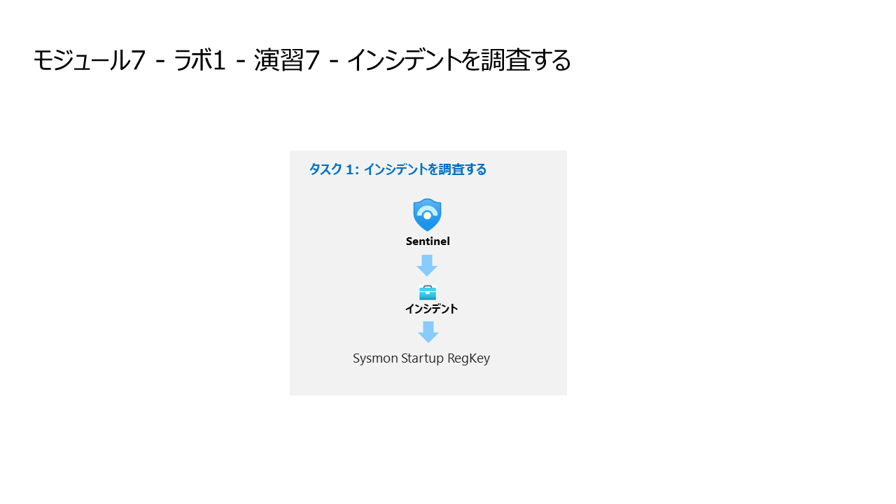

# モジュール7 - ラボ1 - 演習7 - インシデントを調査する

## ラボ シナリオ

あなたは、Microsoft Sentinelを導入した企業で働くセキュリティオペレーションアナリストです。あなたはすでにScheduledとMicrosoft Security Analyticsのルールを作成しました。また、FusionとAnomalies Analyticsのルールも環境内で有効になっています。今こそ、これらのルールによって作成されたインシデントを調査する時です。

インシデントには複数のアラートが含まれることがあります。これは、特定の調査のために関連するすべての証拠を集約したものです。重大度やステータスなど、アラートに関連するプロパティは、インシデント レベルで設定されます。Microsoft Sentinelに、探している脅威の種類とその見つけ方を知らせた後、インシデントを調査することで検出された脅威を監視することができます。

### タスク 1: インシデントを調査する。

このタスクでは、インシデントを調査します。

1. 管理者として WIN1 仮想マシンにログインします。パスワードは**Pa55w.rd** です。  

2. Microsoft Edge ブラウザーで Azure portal (https://portal.azure.com) に移動します。

3. **サインイン** ダイアログ ボックスで、ラボ ホスティング プロバイダーから提供された**テナントのメール** アカウントをコピーして貼り付け、「**次へ**」を選択します。

4. **パスワードの入力**ダイアログ ボックスで、ラボ ホスティング プロバイダーから提供された**テナントパスワード** をコピーして貼り付け、「**サインイン**」を選択します。

5. Azure portal の検索バーに「*Sentinel*」と入力してから、「**Microsoft Sentinel**」を選択します。

6. 以前に作成した Microsoft Sentinel ワークスペースを選択します。

7. 脅威管理 セクションの **インシデント** を選択します。

8. インシデントの一覧を確認します

> **注:** 分析ルールは、同じ特定のログエントリに対してアラートやインシデントを生成しています。これは、ラボで利用するアラートやインシデントをより多く生成するために行われます。
  
9. **MDE Startup RegKey** のインシデントを選択します。

10. 「**すべての詳細を表示**」 ボタンを選択します。

11. ページの左側で、状態を「**アクティブ**」に変更し、「**適用**」を選択します。

12. 「タグ」エリアで「**+**」を選択し、「**RegKey**」というタグを追加して「**OK**」を選択します。

13. ページの中央で、「**コメント**」タブを選択します。

14. コメントを入力してください。*これを調査します。*

15. 「**コメント**」ボタンを選択して、新しいコメントを送信します。

16. 「**エンティティ**」 タブを選択し、その内容を確認します。

17. 「**警告**」タブを選択します。

> **注:** 表示されているアラートの場合、右端に **プレイブックの表示** オプションがあることに注意してください。  これにより、プレイブックを手動で実行することができます。

18. 画面左下にある「**調査**」 ボタンを選択します。

19. 「**MDE Startup RegKey**」のグラフィックを選択します。

> 調査ボタンがグレーアウトしている場合は、以下の操作ができません。

20.	「**タイムライン**」ボタンを選択し、確認します。

21. 「**情報**」ボタンを選択し、確認します。

22.	「**エンティティ**」ボタンを選択し、確認します。

23.	「**分析情報**」ボタンを選択し、確認します。

24.	**WIN1** ホストのグラフィックを選択します (Windows デバイスの名前は、ラボのホスターがどのようにデプロイしたかによって異なる場合があります)。

25.	「**タイムライン**」ボタンを選択し、確認します。

26.	「**情報**」ボタンを選択し、確認します。

27.	「**エンティティ**」ボタンを選択し、確認します。

28.	「**分析情報**」ボタンを選択し、確認します。

29.	グラフの **WIN1** ホストにカーソルを合わせます。アイコンの周りにメニューが表示されます。「**Related Alerts**」を選択します。

30. 関連するアラートのグラフを調べます。

## 演習 8 に進みます。
