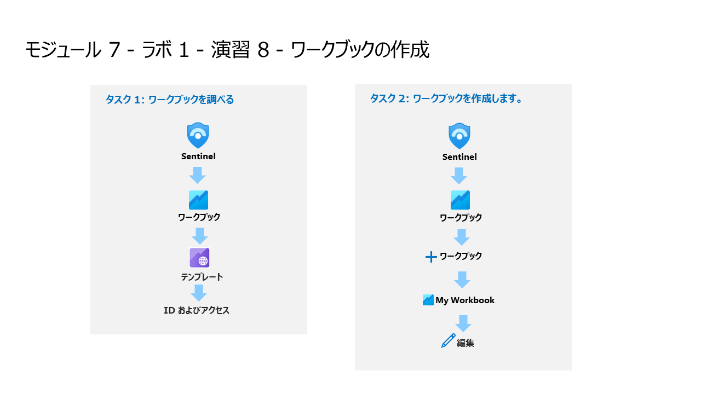

# モジュール 7 - ラボ 1 - 演習 8 - ワークブックの作成

## ラボ シナリオ

あなたは、Microsoft Sentinelを導入した企業で働くセキュリティオペレーションアナリストです。データソースをMicrosoft Sentinelに接続したら、Microsoft Sentinelが採用したAzure Monitor Workbooksを使ってデータを可視化し、監視することができます。

Microsoft Sentinelでは、データ全体でカスタムワークブックを作成できるほか、ワークブックテンプレートも組み込まれており、データソースを接続するとすぐにデータ全体の洞察を得ることができます。

### タスク 1: ワークブックを調べる

このタスクでは、ブックの構成について説明します。

1. 管理者として WIN1 仮想マシンにログインします。パスワードは**Pa55w.rd** です。  

2. Microsoft Edge ブラウザーで Azure portal (https://portal.azure.com) に移動します。

3. **サインイン** ダイアログ ボックスで、ラボ ホスティング プロバイダーから提供された**テナントのメール** アカウントをコピーして貼り付け、「**次へ**」を選択します。

4. **パスワードの入力**ダイアログ ボックスで、ラボ ホスティング プロバイダーから提供された**テナントパスワード** をコピーして貼り付け、「**サインイン**」を選択します。

5. Azure portal の検索バーに「*Sentinel*」と入力してから、「**Microsoft Sentinel**」を選択します。

6. Microsoft Sentinel ワークスペースを選択します。

7. 「**ブック** 」を選択します。

8. 「**ID およびアクセス**」を選択し、「**テンプレートの表示**」ボタンを選択します。

9. 「ID およびアクセス」ワークブックを確認します。

10. 右上隅の「x」を選択して、ワークブックを閉じます。

11. **テンプレート** タブで「**Azure AD 監査ログ**」を検索して選択してから、右側ペインから「**保存**」ボタンを選択します。 

12. 場所に適切な場所（例：米国東部）を選択して、「**OK**」を選択します。適切な場所は通常、既定です。

13. 「**保存されたワークブックの表示**」ボタンを選択します。

### タスク 2: ワークブックを作成します。

このタスクでは、高度な視覚化を備えた新しいワークブックを作成します。

1. Azure Sentinel ポータルの「**ブック**」領域に戻ります。

2. 「**+ ブックの追加**」を選択します

3. 「**編集**」を選択します

#### ヘッダーテキストを編集します:

4. ワークブックのタイトルの下の「**編集**」を選択し、**## New workbook** を **## My workbook**に変更します。

5. ヘッダー テキストに対して、「**編集が完了しました**」を選択します。

6. 表示される唯一のグラフの下で、「**編集**」を選択します。

7. 複数のテーブルにわたるカウントの和集合を提供するKQLステートメントを確認してください。

8. グラフに対して、「**編集が完了しました**」を選択します。

9. グラフ領域の横の **「...」** を選択し、「**+ 追加**」を選択し、「**クエリの追加**」を選択します。

10. クエリ ボックスに「**SecurityEvent**」と入力し、「**クエリの実行**」ボタンを選択します。

11. **時間の間隔**を「**過去3日**」に変更します。

12. **視覚化** を「**棒グラフ**」に変更して、結果を確認します。

13. **視覚化** を「**時間グラフ**」に変更して、結果を確認します。

14. クエリタブの「**Style**」を選択します。

15. 「**この項目をユーザー設定の幅にします**」ボックスをチェックします。

16. パーセント幅を「**75**」に、最大幅 を「**75**」に設定します。

17. クエリタブの「**詳細設定**」を選択します。

18. 「**編集中でないときに更新アイコンを表示する**」ボックスをチェックします。 

19. 新しいグラフに対して、「**編集が完了しました**」を選択します。

28. 「**Save**」アイコンを選択し、**タイトル**を **My Workbook**、**場所** を**米国東部** に変更し、「**保存**」を再度選択します。

29. 右上の「x」を選択して、ワークブックを閉じるか、Microsoft Sentinel ポータルで、「**ブック**」を選択します。

30. 必要に応じて、「**マイブック**」タブを選択します。

31. 作成したワークブックを選択します。

32. 「**保存されたブックの表示**」を選択します。

## これでラボは完了です。
