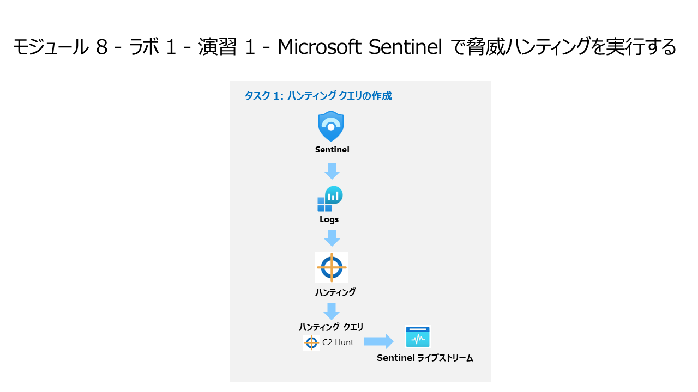

# モジュール 8 - ラボ 1 - 演習 1 - Microsoft Sentinel で脅威ハンティングを実行する

## ラボ シナリオ



あなたは Microsoft Sentinel を実装した企業で働いているセキュリティ オペレーションアナリストです。あなたはコマンドと制御 (C2 または C&C) テクニックについて脅威インテリジェンスを受け取りました。その脅威に対してハンティングとウォッチを実行する必要があります。

> **重要:** このラボで使用するログデータは、前のモジュールで作成したものです。演習 5 の WIN1 サーバーの**攻撃 3** を確認してください。

> **注:**  前のモジュールでデータを探索するプロセスをすでに経験しているため、ラボでは開始するための KQL ステートメントを提供しています。  

### タスク 1: ハンティング クエリの作成

このタスクでは、ハンティングクエリを作成し、結果をブックマークして、ライブ ストリームを作成します。

1. 管理者として WIN1 仮想マシンにログインします。パスワードは**Pa55w.rd** です。  

2. Microsoft Edge ブラウザーで Azure portal (https://portal.azure.com) に移動します。

3. **サインイン** ダイアログ ボックスで、ラボ ホスティング プロバイダーから提供された**テナントのメール** アカウントをコピーして貼り付け、「**次へ**」を選択します。

4. **パスワードの入力**ダイアログ ボックスで、ラボ ホスティング プロバイダーから提供された**テナントパスワード** をコピーして貼り付け、「**サインイン**」を選択します。

5. Azure portal の検索バーに「*Sentinel*」と入力してから、「**Microsoft Sentinel**」を選択します。

6. Microsoft Sentinel ワークスペースを選択します。

7. 「**ログ**」を選択する 

8. 新規クエリ1のスペースに以下のKQLステートメントを入力します。

> **重要:** エラーを防止するため、最初に KQL クエリをメモ帳に貼り付けてから、**新しいクエリ 1** のログ ウィンドウにコピーしてください。

```KQL
let lookback = 2d;
DeviceEvents
| where TimeGenerated >= ago(lookback) 
| where ActionType == "DnsQueryResponse"
| extend c2 = substring(tostring(AdditionalFields.DnsQueryString),0,indexof(tostring(AdditionalFields.DnsQueryString),"."))
| where c2 startswith "sub"
| summarize count() by bin(TimeGenerated, 3m), c2
| where count_ > 5
| render timechart 
```

   

9. このステートメントの目的は、C2 が一貫してビーコンを出しているかどうかを確認するための視覚化を提供することです。オペレーター概要などで、3m の設定を 30 秒以上に調整してください。count_ > 5 の設定を他のスレッショルド カウントに変更して、影響を確認します。

10. これで、C2 サーバーにビーコン送信されている DNS リクエストが特定できました。  次に、どのデバイスがビーコンになっているかを確認します。  次の KQL ステートメントを入力します。

```KQL
let lookback = 2d;
DeviceEvents
| where TimeGenerated >= ago(lookback) 
| where ActionType == "DnsQueryResponse"
| extend c2 = substring(tostring(AdditionalFields.DnsQueryString),0,indexof(tostring(AdditionalFields.DnsQueryString),"."))
| where c2 startswith "sub"
| summarize cnt=count() by bin(TimeGenerated, 3m), c2, DeviceName
| where cnt > 5
```

   

> **注:** 生成されるログ データは、1 つのデバイスからのみです。

11. ウィンドウの右上の「x」を選択して、ログ ウィンドウを閉じ、「**OK**」をクリックして、変更を破棄します。再度 Microsoft Sentinel ワークスペースを選択し、**脅威管理** 領域の下で、**ハンティング** を選択します。

12. コマンド バーで「**+ 新しいクエリ**」を選択します。

13. 名前には「**C2 Hunt**」と入力します。

14. **カスタム クエリ**には、次の KQL ステートメントを入力します。

```KQL
let lookback = 2d;
DeviceEvents
| where TimeGenerated >= ago(lookback) 
| where ActionType == "DnsQueryResponse"
| extend c2 = substring(tostring(AdditionalFields.DnsQueryString),0,indexof(tostring(AdditionalFields.DnsQueryString),"."))
| where c2 startswith "sub"
| summarize cnt=count() by bin(TimeGenerated, 3m), c2, DeviceName
| where cnt > 5
```

15. **エンティティ マッピング (プレビュー)** で、以下を選択します。

|設定|値|
|:----|:----|
|エンティティの型|Host|
|ID|HostName|
|値|DeviceName|

16. **戦術と手法**で、「**Command and Control**」を選択します。「**作成**」を選択して、ハンティング クエリを作成します。

17. **「Microsoft Sentinel | ハンティング」** ブレードで、**クエリの検索** から先ほど作成した **C2 Hunt** クエリを検索します。

18. リストの中から「**C2 Hunt**」を選択します。

19. 画面の右側の「**クエリの実行**」ボタンを選択します。

20. 結果の数は、結果の列の下に表示されます。

21. 「**結果の表示**」ボタンを選択します。KQLクエリが自動的に実行されます。

22. 結果の最初の行を選択します。 

23. 「**ブックマークの追加**」ボタンを選択します。

24. **ブックマークの追加** ブレードで、「**作成**」 を選択します。

25. Microsoft Sentinel portal のハンティング ページに戻ります (ヒント: 左にスクロールします)。

26. 「**ブックマーク**」タブを選択します。

27. 結果一覧で作成したブックマークを選択します。

28. 「**調査**」 ボタンを選択します。

29. グラフを調査します。

30. 右上の「x」を選択して、ウィンドウを閉じて、Microsoft Sentinel ポータルのハンティング ページに戻ります。

31. 「**クエリ**」タブを選択します

32. **C2 Hunt** クエリを再度検索して、選択します。

33. 右側の行の最後にある **「...」** を選択して、コンテキスト メニューを開きます。

34. 「**ライブストリームに追加**」を選択します。

### タスク 2: NRTクエリルールの作成

このタスクでは、ライブストリームを使用する代わりに、NRT 分析クエリ ルールを作成します。NRT ルールは 1 分ごとに実行され、1 分間振り返ります。NRT ルールの利点は、アラートとインシデント作成ロジックを使用できることです。

1. Microsoft Sentinel の分析をクリックします。

1. メニューから作成を選択し、NRTクエリルールをクリックします。

1. 分析ルール ウィザードを構成します。

    |項目|値|
    |---|---|
    |名前|**NRT C2 Hunt**|
    |説明|**NRT C2 Hunt**|
    |戦術と手法|**Command and Control**|
    |重大度|**高**|

1. 「次：ルールのロジックを設定>」をクリックします。

1. ルールのクエリに以下のKQLクエリを入力します。

    ```KQL
    let lookback = 2d;
    DeviceEvents | where TimeGenerated >= ago(lookback) 
    | where ActionType == "DnsQueryResponse"
    | extend c2 = substring(tostring(AdditionalFields.DnsQueryString),0,indexof(tostring(AdditionalFields.DnsQueryString),"."))
    | where c2 startswith "sub"
    | summarize cnt=count() by bin(TimeGenerated, 3m), c2, DeviceName
    | where cnt > 5
    ```
    
1. 残りのオプションはデフォルトのままにします。「次：インシデントの設定>」をクリックします。

1. インシデントの設定タブで、既定値のままにして、「次：自動応答>」をクリックします。

1. 自動応答タブで、「アラートのオートメーション（クラッシック）」で「PostMessageTeams-OnAlert」を選択し、「次：レビュー」をクリックします。

1. 「確認と作成」タブで、設定を確認し「作成」をクリックします。

### <a name="task-3-create-a-search"></a>タスク 3:検索の作成

このタスクでは、検索ジョブを使用して C2 を検索します。 

1. Microsoft Sentinel で **[検索]** ページを選択します。 

1. コマンド バーから **[復元]** ボタンを選択します。

    >**注:** ラボには復元元となるアーカイブ済みのテーブルがありません。 通常のプロセスでは、アーカイブ済みのテーブルを復元して検索ジョブに含めます。

1. 使用可能なオプションを確認し、 **[キャンセル]** ボタンを選択します。

1. **[検索]** タブを選択します。

1. 検索ボックスの下にある "*テーブル*" フィルターを選択し、**DeviceRegistryEvents** に変更し、 **[適用]** を選択します。

1. 検索ボックスに「**reg.exe**」と入力し、 **[開始]** を選択します。

1. **[保存した検索]** タブを選択します。

1. 検索ジョブにより、**DeviceRegistryEvents_####_SRCH** という名前の新しいテーブルが作成されます。

1. 検索ジョブが完了するまで待ちます。 状態に *[更新中]* 、 *[処理中]* 、 *[検索が完了しました]* の順に表示されます。

1. **[View search results](検索結果の表示)** を選択します。 これにより、"*ログ*" で新しいタブが開き、新しいテーブル名 **DeviceRegistryEvents_####_SRCH** クエリが実行され、結果が表示されます。
   
