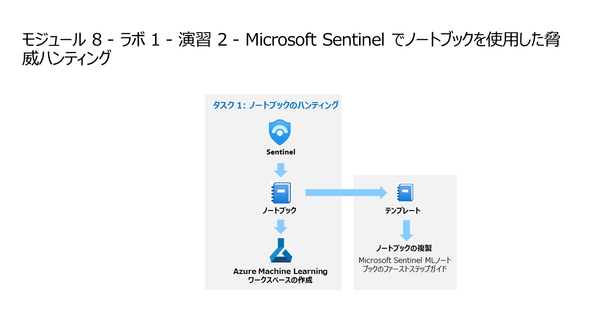

# モジュール 8 - ラボ 1 - 演習 2 - Microsoft Sentinel でノートブックを使用した脅威ハンティング

## ラボ シナリオ

あなたは Microsoft Sentinel を実装した企業で働いているセキュリティ オペレーションアナリストです。Microsoft Sentinel ノートブック を使った脅威ハンティングの利点を調査する必要があります。

### タスク 1: ノートブックのハンティング

このタスクでは、Microsoft Sentinel でノートブックを使用する方法について説明します。

1. 管理者として WIN1 仮想マシンにログインします。パスワードは**Pa55w.rd** です。  

2. Microsoft Edge ブラウザーで Azure portal (https://portal.azure.com) に移動します。

3. **サインイン** ダイアログ ボックスで、ラボ ホスティング プロバイダーから提供された**テナントのメール** アカウントをコピーして貼り付け、「**次へ**」を選択します。

4. **パスワードの入力**ダイアログ ボックスで、ラボ ホスティング プロバイダーから提供された**テナントパスワード** をコピーして貼り付け、「**サインイン**」を選択します。

5. Azure portal の検索バーに「*Sentinel*」と入力してから、「**Microsoft Sentinel**」を選択します。

6. Azure Sentinel ワークスペースを選択します。

7. Azure Sentinel ワークスペースで、「**ノートブック**」を選択します。

8. 「**Azure Machine Learning ワークスペースの設定**」を選択します。

9. 「サブスクリプション」ボックスでお使いのサブスクリプションを選択します。

10. リソース グループに対して、「**新規作成**」を選択して、名前として **RG-MachineLearning** を入力し、「**OK**」を選択します。 

11.	ワークスペースの詳細 セクションで次の作業を行います。
- お使いのワークスペースに一意の名前を付けます。
- リージョンを選択する (既定では合理的な選択肢が用意されているはずです)。
- 既定のストレージ アカウント、キーコンテナー、およびApplication Insights情報を保持します。
- 「コンテナーレジストリ」オプションは、「**なし**」のままにできます。

12.	ページの下部で「**確認および作成**」を選択し、「**作成**」を選択します。 

> **注:** Machine Learning ワークスペースのデプロイには少し時間がかかる場合があります。 

13.	デプロイが完了したら、Microsoft Sentinel ポータルに戻ります。

14. 「**ノートブック**」を選択してから、「**テンプレート**」タブを選択します。 

15. 「**Microsoft Sentinel MLノートブックのファーストステップガイド**」を選択してから、「**ノートブック テンプレートの複製**」ボタンを選択します。**ノートブックの複製** ブレードで、既定の情報を使用して「**保存**」を選択します。

16. 「**ノートブックの起動**」ボタンを選択します。Microsoft Azure Machine Learning Studio に表示されているウィンドウを閉じます。

17.	画面上部の**Compute:** インスタンス セレクターの横で、**New Compute**の「**+**」記号を選択します。

18.	**Compute name** に対して一意の名前を入力し、利用可能な最初のコンピューティングを選択します。**ヒント:** Workload type が Development。

19.	画面の下部にある 「**Create**」 ボタンを選択します。表示されるフィード ウィンドウを閉じます。この処理には数分かかります。

20.	画面上部の **Compute:** インスタンス セレクター に 「*ComputeName* - Running」 が表示され、ノートブックの右上に使用するカーネルが 「**Python 3.8 - AzureML**」 であることを確認します。

21. コマンドバーから **消しゴム** アイコンを選択して、ノートブックからすべての結果を消去します。

> **注** 上記の手順を完了してノートブックにアクセスできない場合、代わりに GitHub ページで手順を確認できます。  ノートブックファイルをこちらでご覧ください: [GitHub 上の Azure Sentinel ノートブック](https://github.com/Azure/Azure-Sentinel-Notebooks/blob/8122bca32387d60a8ee9c058ead9d3ab8f4d61e6/A%20Getting%20Started%20Guide%20For%20Azure%20Sentinel%20ML%20Notebooks.ipynb) 

## これでラボは完了です。
